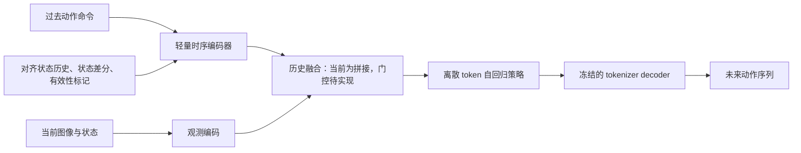

# Past2Next 改进计划与当前阶段

更新日期：2026-09-21。范围：`past2next_bug_fixed` 中的 LIBERO Past2Next 策略改进。

**当前阶段：基础修复与连续状态历史版本已实现，功能测试已通过；H8 版本已开始正式双 GPU 训练，成功率与速度收益尚待对照实验验证。**

## 1. 目标与已经确定的边界

目标是在任务成功率、方法新颖性和推理速度之间取得平衡。模型和代码结构可以调整，但始终保留三个核心要素：动作 tokenizer、离散 token 自回归 policy、过去动作与动态特征条件。

当前主线是验证：把过去动作和机器人实际状态响应按时间对齐，能否帮助模型生成更好的下一动作块。

- 使用 conjugate 版本的动作 tokenizer；当前 policy 实验先冻结并复用同一个 checkpoint。
- 训练采用离线示范数据和 self-past 历史替换，不在训练中执行生成动作，不引入 DAgger 或在线教师。
- 推理使用执行层确认的过去动作，并逐控制步记录实际状态。
- 图像保持两帧，首先增加成本较低的低维状态历史。
- `val_ratio=0.1` 是用户选定的划分，保留该设置。
- 独立保留各策略版本，方便复现和对照；state-history 的两个旧启动入口已合并为 [train_state_history.sh](train_state_history.sh)。

## 2. 已完成的工作

| 工作 | 当前状态与含义 | 主要代码 |
| --- | --- | --- |
| EMA 共享参数重复更新修复 | 每个独立 Parameter 每次只更新一次，避免 token embedding/output head 的共享权重被重复更新 | [ema_model.py](oat/model/diffusion/ema_model.py) |
| LIBERO 归一化数据隔离 | 新拟合的 normalizer 只统计训练 episode；tokenizer 与 policy 的新训练都受益 | [zarr_dataset.py](oat/dataset/zarr_dataset.py) |
| 禁止生成 BOS | 每一步采样/argmax 前屏蔽 BOS，覆盖普通预测和 self-past 内部生成 | [transformer_cache.py](oat/model/autoregressive/transformer_cache.py) |
| 起始历史与 self-past 进度修复 | 零填充、有效性标记、跳过不存在的 previous window；按成功 optimizer update 记录并恢复课程进度 | [历史数据集](oat/dataset/zarr_dataset_with_past.py)、[self-past policy](oat/policy/past2next_self_past.py) |
| 评估协议整理 | 修复旧入口的默认协议和目录清理；本主线使用 candidate evaluator，并保留各版本对应的 runner | [evaluate_candidate.py](scripts/evaluate_candidate.py)、[旧评估入口](scripts/eval_policy_sim.py) |
| 执行确认的动作历史 | 预测不会立即写入历史；执行层反馈实际执行前缀后才更新，支持部分执行与零执行 | [executed policy](oat/policy/past2next_executed_past.py)、[runner](oat/env_runner/executed_action_runner.py) |
| 连续状态历史与融合 | 数据采样、每控制步状态缓存、状态差分、相对旋转、时间编码和 AR 条件融合均已实现 | [state-history policy](oat/policy/past2next_state_history.py) |
| 统一训练入口 | 双 GPU、在线 W&B、环境评估、只保留评估轮次 checkpoint | [train_state_history.sh](train_state_history.sh) |

这些修复作用于当前代码及之后的训练。已有 checkpoint 的训练过程和已保存统计量不会被追溯修改。当前使用的历史 conjugate tokenizer 保留自己的 normalizer；其旧的全数据归一化统计，是后续建立严格数据隔离的两阶段基线时需要单独处理的事项。

## 3. 各版本的关系与对照组

| 版本 | 离线训练中的过去动作 | 推理中的过去动作 | 新增连续状态历史分支 |
| --- | --- | --- | --- |
| [past2next.py](oat/policy/past2next.py) | 示范记录 | 预测后提前更新，假定计划执行前缀全部执行 | 无 |
| [past2next_self_past.py](oat/policy/past2next_self_past.py) | 按课程混合示范历史与生成历史 | 同上 | 无 |
| [past2next_executed_past.py](oat/policy/past2next_executed_past.py) | 示范记录 | 执行确认的命令前缀 | 无 |
| [past2next_self_past_executed.py](oat/policy/past2next_self_past_executed.py) | 与原 self-past 相同 | 执行确认的命令前缀 | 无 |
| [past2next_state_history.py](oat/policy/past2next_state_history.py) | 保留离线 self-past | 执行确认的命令前缀 | 有 |

**当前直接对照组选 self-past + executed 版本。** 它与 state-history 候选保持相同的 self-past 训练和推理反馈规则，便于判断新增历史分支的贡献。入口为 [train_self_past_executed_live.sh](train_self_past_executed_live.sh)。

[train_baseline.sh](train_baseline.sh) 对应修复后的 `train_past2next_scratch` 配方，实际实例化的是 self-past policy，不是 expert-only 的 `past2next.py`。其训练时长和 rollout 默认设置也与当前长训练脚本不同，比较前必须对齐。

两个 live 启动脚本的 checkpoint 留存设置目前不同；正式对照前应对齐评估 epoch 网格和模型选择规则，并确保待比较的 checkpoint 均有保留。

原 self-past 与 self-past + executed 在架构配置匹配时可复用权重。state-history 增加了历史编码器和条件位置编码，需要重新训练 policy；动作 tokenizer 仍可复用。

## 4. 当前已实现的历史方案

```text
连续低维状态 + 相邻状态变化 + 对齐的过去动作 + 有效性标记
                              ↓
               时间位置编码 + 2 层 Transformer
                              ↓
                   4 个查询汇总为历史条件
                              ↓
与原有两帧图像/状态、过去动作和动作命令差分条件拼接
                              ↓
          离散 AR policy → 动作 tokens → 冻结 tokenizer 解码
```

状态包括末端位置、末端姿态和夹爪开度。位置与夹爪变化采用归一化状态的相邻差分；姿态使用 xyzw 四元数转旋转矩阵，再将绝对姿态及世界系相对旋转 `R[t] @ R[t-1].T` 表示为 6D。没有把四元数直接相减，也没有将这些差分除以时间间隔。

这里的“状态变化”描述测得的响应；“过去动作”描述下发的命令，两者不是同一个量。原有动作命令的一阶/二阶差分条件仍然保留，也不应称作实测速度或加速度。

| 设置 | H8（默认） | H16 |
| --- | --- | --- |
| 连续状态帧数 | 8 | 16 |
| 对齐的过去动作数 | 7 | 15 |
| 可计算的相邻状态变化 | 7 | 15 |
| 每路相机的图像帧数 | 2 | 2 |
| 新增历史汇总 token 数 | 4 | 4 |
| AR 条件总长度 | 15 | 23 |

时间对齐为：状态 `s[t-H+1] … s[t]`，动作 `a[t-H+1] … a[t-1]`；动作 `a[i]` 对应状态变化 `s[i] → s[i+1]`。episode 开始只有真实存在的状态有效，补齐位置带掩码，不跨 episode 取历史。

推理 runner 在一个动作块内部的每个实际控制步记录低维状态，因此每执行 8 步重新规划也不会漏掉中间状态。历史快照通过额外的小型 RPC 返回；这部分开销需要纳入后续耗时测量。

训练中的状态仍来自示范。self-past 被选中时，命令历史可能来自模型生成，不能把它与示范状态变化解释为一次真实执行后的因果转移。当前没有添加动力学监督、命令跟踪误差损失或状态条件 tokenizer。

实现细节见 [STATE_HISTORY.md](STATE_HISTORY.md)、[历史编码器](oat/model/state_action_history.py)、[数据集](oat/dataset/zarr_dataset_with_state_history.py)和[runner](oat/env_runner/state_history_runner.py)。

## 5. 当前训练设置与进度快照

下表是 **统一 bash 入口覆盖后的有效设置**；直接运行 YAML 不会自动应用这些覆盖。

| 项目 | 当前默认值 |
| --- | --- |
| GPU / batch | GPU 0、1；每卡 32，全局 64 |
| 训练长度 | 2001 epochs，epoch 标签 0–2000 |
| 图像 / 动作 | 两帧图像；预测 16 步，每轮通常执行前 8 步 |
| 历史 | H8 状态，7 步过去动作 |
| AR / 历史编码器 | AR 宽度 256、8 层、8 头；历史宽度 128、2 层、4 头 |
| Self-past | 最大替换概率 0.5；1000 次 optimizer update warmup，4000 次 ramp |
| Policy / vision 学习率 | 均为 `1e-5` |
| 数据 | LIBERO-10 N500，训练/验证比例 90/10，划分 seed 42 |
| 日志 / EMA | W&B online，修复后的 EMA 开启 |
| 离线验证 | 每 epoch；包含 expert-history 与 generated-history 验证 |
| 环境评估 | `lazy_eval=false`，corrected 协议；每 100 epoch，100 trials、10 个并行环境 |
| Checkpoint | 只在评估轮次保存，全部保留；无额外 snapshot、无 `latest.ckpt` |

默认保存 `ep-0000_sr-….ckpt`、`ep-0100_sr-….ckpt`，直到 `ep-2000`，共 21 个。epoch 0 的评估发生在第一轮训练结束后。checkpoint 间隔随 `ROLLOUT_EVERY` 自动调整。

当前复用的 conjugate tokenizer：

```text
/workspace/past2next_clean/output/20260827/070913_train_oattok_so3aug_libero10_N500/checkpoints/ep-1300_mse-0.001.ckpt
```

**2026-09-21 07:05:16 UTC 的本地检查记录：**

- H8 正式训练已启动，检测到 launcher 和两个训练进程。
- 运行目录：[state_history_seed42_20260921_065955_803707596](output/training/state_history_seed42_20260921_065955_803707596)。
- [保存配置](output/training/state_history_seed42_20260921_065955_803707596/.hydra/config.yaml)确认从头训练 policy，复用上述 tokenizer。
- [logs.json](output/training/state_history_seed42_20260921_065955_803707596/logs.json)最新记录为 epoch 0、`global_step=1944`；尚无验证/rollout 成功率或 checkpoint 文件。
- 本地未发现 H16 的正式训练记录。

这是一份采样时刻的进度记录，后续以该运行目录的新日志为准。运行产物通常不随代码提交到 Git。

## 6. 已验证与尚未证明的内容

之前完成的相关验证包括 200 项 CPU 测试，以及完整模型配置、现有 conjugate tokenizer 和少量真实 LIBERO 数据的前向、反向、预测检查。脚本合并后也完成了语法及默认/覆盖参数的 dry-run 检查。本次编写文档没有重新跑训练或整套测试。

| 已有证据 | 对应检查 |
| --- | --- |
| H8/H16 因果采样、边界掩码、训练集归一化 | [dataset tests](tests/test_state_history_dataset.py) |
| 相对旋转、q/-q 一致性、动作对齐、补齐隔离 | [encoder tests](tests/test_state_action_history.py) |
| Self-past 反向传播、混合精度、优化器覆盖、EMA、checkpoint 恢复 | [policy tests](tests/test_state_history_policy.py) |
| 双进程 DDP 的梯度和权重同步 | [CPU gloo tests](tests/test_state_history_ddp.py) |
| 每控制步缓存、部分/零执行、异步 worker 与重置 | [runner tests](tests/test_state_history_runner.py)、[闭环模拟测试](tests/test_state_history_closed_loop.py) |

这些检查支持代码行为与接口正确，不能证明成功率已经提高。尚需收集同条件的任务成功率、推理延迟、吞吐和显存结果。历史 015/043/046 的分数也不能直接当作此次新架构的受控对照，见[历史比较的限制](COMPARISON_015_043_046.md)。

## 7. 前期方案回顾与下一阶段改进详解

本节补回前期讨论中的完整研究路线：**先验证历史与动态信息的表示，再研究如何利用历史减少动作 token 的生成成本。** 以下明确区分已有代码、待补对照和研究候选；门控、动态辅助目标、自适应 token 预算和条件残差 tokenizer 均未实现。本次补充只更新文档，第 5 节保留原时间戳的训练进度快照。

### 7.1 原方案针对的三个问题

1. **原来的动态特征主要描述命令变化。** `acc/jerk` 是归一化过去动作的一阶、二阶差分，可以描述命令是否转向、是否变化剧烈，但不能直接说明机器人实际移动了多少。新增状态历史让策略同时看到命令和实测响应；状态差分包含控制器响应、接触约束等因素的影响，是否能改善决策仍需实验确认。
2. **原来的动作历史没有独立的时间编码器。** 各步动作先经过共享 MLP，再交由 AR decoder 的 cross-attention 处理。原方案希望先将有时间顺序的历史整理成少量条件 token。当前 Transformer 历史分支已经实现这一点，但需要单独的动作历史对照来判断收益来源。
3. **Self-past 没有产生新的执行后状态。** 替换过去动作后，当前图像、状态和监督目标仍来自示范。它训练的是对生成历史的适应，不能据此认定策略已学会从自身动作导致的状态偏移中恢复。恢复表现必须通过闭环评估确认；这不要求改成在线训练。

原方案的整体结构如下。当前已实现“历史编码 + 条件拼接”，图中的门控属于下一步候选：



### 7.2 恢复原来的 A → B → C → D → E 实验顺序

首先固定 **K=8 个动作 token**，保持视觉 backbone、AR 主体、tokenizer、数据划分及训练预算一致。这里的“一致”是指结构和训练规则一致；tokenizer 冻结，视觉编码器和 AR 仍按基线正常训练。

| 实验 | 在前一项基础上增加什么 | 要回答的问题 | 当前状态 |
| --- | --- | --- | --- |
| A | 修复后的 self-past + executed 基线，无新增时间编码分支 | 当前可复现的成功率和成本是多少？ | 代码和入口已有；需整理同条件对照结果 |
| B | 仅对动作历史做时间编码，汇总为少量条件 token | 单纯改善动作历史表示是否有用？ | 尚无独立 B 版本；现有 C 的编码器同时使用了状态 |
| C | 在 B 的历史输入中加入对齐的实测状态、状态变化和有效性标记 | 实际运动信息是否带来额外收益？ | 当前 state-history 是 C 的原型，H8 已启动训练；增益未证明 |
| D | 在 C 上增加根据当前观测调节历史贡献的门控 | 是否能减少无关或错误历史的影响？ | 待设计、实现和消融 |
| E | 在 D 上增加短期动态预测辅助目标 | 真实状态转移监督是否改善共享表示与闭环表现？ | 待设计、实现和消融 |

**我们目前已实现 C 的组合结构，但还没有完成 A→B→C 的逐项实证。** 下一步应补齐 B，并对 A/B/C 做同条件比较；不需要为了补对照而停止当前 H8 训练。A 统一使用执行确认历史，是为了把推理反馈修复从新历史表示的效果中分离出来。

E 的主比较是 `D+辅助目标` 对 D；建议再补一个 `C+辅助目标` 对 C，判断辅助目标是否依赖门控。不要一次同时换 tokenizer、增加门控、加辅助损失，再把全部增益归因于某个组件。

### 7.3 第一阶段：先把 A/B/C 的历史表示结论做清楚

**B 的最小设计。** 保留 A 原有图像/当前状态、raw past action 和命令差分条件，再增加“仅动作输入”的轻量时间编码分支。采用与 C 相同的时间位置编码、编码宽度、层数和汇总 token 数，尽量对齐条件长度和参数预算。这样可以判断时序建模的价值，并减少“只是多了一组条件 token”的解释。

**C 的最小设计。** 在相同时间槽中加入绝对状态与相邻变化：状态 `s[i]`、到达该状态前的命令 `a[i-1]`、转移 `s[i-1]→s[i]` 和对应有效性。图像仍为两帧；连续状态必须来自每个实际控制步，不能只缓存两次 policy 调用的观测。当前实现已满足这些采集与对齐要求。

进一步把 C 拆成两项对照：`B+绝对状态历史`，以及 `B+绝对状态历史+状态差分`。差分本来可以由相邻状态计算出来，它的可能价值是提供更合适的表示和学习偏置，而不是引入新的独立观测信息。

首轮建议使用当前的 128 维、2 层、4 头、4 个汇总 token 设置。先比较 A/B/C 的成功率和延迟；证据不足时再考虑加宽或加深。应同时记录实际参数量，必要时增加相近参数量的对照，而不能仅凭模型变大就认定时间建模有效。

**H8/H16 属于另外一条长度对照轴。** 当前要求 `H=past_n+1`：H8→H16 同时把动作历史 7→15，AR 条件总长度 15→23。可补一个 past_n=15 的无状态历史基线；若要单独改变状态长度而保持动作长度不变，需要另做对齐设计。

**实现边界：** 历史宽度、层数和汇总 token 数已有配置字段；B、关闭状态差分、关闭时间编码等功能隔离开关尚未实现，不能直接当作现成 bash 参数使用。

### 7.4 第二阶段 D：根据当前观测调节历史信息的贡献

**目的。** 历史有时能补充当前图像，有时会延续已经不适合当前场景的动作趋势。门控的假设是让策略根据当前观测、历史表示和有效历史长度，决定历史分支应有多大影响。不能预先假定它会自动学会判断历史可靠性。

一种拟议的融合方式是让当前观测分支保留直接通路，在历史 attention 的输出上施加门控：

$$
g_t=\sigma\!\left(\mathrm{MLP}(\operatorname{pool}(V_t),\operatorname{pool}(M_t),m_t)\right),
\qquad
Y_t=Y_{\mathrm{obs},t}+g_t\odot Y_{\mathrm{hist},t}.
$$

`V_t` 是当前观测特征，`M_t` 是历史编码，`m_t` 只包含当前可获得的有效性等信息。首版可先用单个标量门，随后才比较按通道或按历史 token 的门。上式是候选设计，不是当前代码已有的计算路径。

**必须明确门控范围。** 当前 AR 同时接收原始动作投影、动作命令差分，以及混合状态/动作的历史汇总 token：

```text
当前条件 = [图像/当前状态, 命令差分, raw past action, 历史汇总]
```

只给新增的历史汇总加门时，其他两个动作历史通路仍存在。这项实验只能回答“是否应调节新增分支”。如果要验证“抑制全部错误历史”，需把所有打算控制的历史通路纳入门控，并与只控制新增分支的版本分开比较。当前汇总 token 混合了状态和动作；若想独立保留状态、抑制动作，还需拆分表示。

将输入 token 乘零不一定等于关闭历史，因为投影偏置、位置编码和 attention 的归一化仍可能让它产生影响。硬关闭对照应明确采用真正的 attention mask 或历史 attention 输出门控。

建议比较固定开启、固定关闭和可学习门控，并明确关闭了哪些历史分支。固定关闭是诊断消融；最终主线模型仍保留过去动作与动态条件。除成功率和耗时外，记录门值随任务阶段、有效历史长度和历史扰动的变化。门值可视化只是诊断证据，必须结合受控扰动和恢复结果，才能讨论可靠性选择是否有效。

### 7.5 第三阶段 E：短期动态预测作为训练辅助目标

**目的。** 在模仿学习之外，让共享历史表示学习与实际状态响应有关的信息。辅助头预测短期位置变化、相对旋转和夹爪开度变化；它只在训练时使用，推理时可以移除，因此本身不必增加部署开销。

从一个控制步预测开始，再视结果扩展到例如 2/4 步。设 `H_true` 是截至 t 的真实示范历史，`A_demo[t:t+k]` 是示范中实际执行的未来 k 个命令，一种动作条件化的设计为：

$$
h_t^{\mathrm{true}}=E_\theta(H_t^{\mathrm{true}}),
\qquad
\widehat{\Delta s}_{t\to t+k}
=F_\phi\!\left(h_t^{\mathrm{true}},\operatorname{stopgrad}(A^{\mathrm{demo}}_{t:t+k})\right).
$$

未来示范命令是**辅助头的训练输入**，用于明确“在什么命令下预测响应”，不能进入 policy 的当前条件。未来状态只作为监督标签。也可以研究不输入未来命令的预测头，但那是在预测示范行为的条件分布，不能把两种任务混为一谈。

辅助损失可以由位置、旋转、夹爪三部分组成，并与原 token 交叉熵相加：

$$
L=L_{\mathrm{AR}}+\lambda_{\mathrm{dyn}}L_{\mathrm{dyn}},
\qquad
L_{\mathrm{dyn}}=w_pL_p+w_RL_R+w_gL_g.
$$

位置/开度使用明确归一化后的误差；旋转使用相对旋转的几何损失，或明确的 6D 表示监督，避免直接减四元数。权重需要小规模验证，并监测辅助任务是否压过动作预测主目标。动态误差降低本身不能证明成功率提高。

**与 self-past 的正确结合：**

```text
示范状态 + self-past 混合命令 → 共享历史编码器 → AR 主损失
示范状态 + 真实配对的示范命令 → 同一个编码器 → 动态辅助头 → 未来状态标签
```

两条训练分支共享编码器参数，辅助分支使用真实历史重新编码，或只选主分支中未替换的样本。不能把生成命令与专家下一状态组成“真实转移”监督。重新编码会增加训练成本，需要记录；只选未替换样本则会改变辅助任务有效样本量，也需报告。

实现时必须满足以下约束：

1. **防止未来泄漏。** 新 dataset 字段中的未来状态和有效性只用于 loss，不能加入 observation ports 或 AR 条件。episode 末尾重复填充的未来帧不能当作真实标签。
2. **防止历史内的目标泄漏。** 当前历史 Transformer 可双向查看整个已发生窗口。如果用窗口中第 i 个隐状态预测 `s[i+1]`，它可能已经通过 attention 看到答案。优先从截至 t 的汇总预测 t 之后的标签；若逐历史步监督，应重新编码各自前缀或改用因果 mask。
3. **保留有效梯度路径。** 标签和示范命令不需要梯度，但 `h_true` 必须保持可微，才能训练共享编码器。辅助分支不能放在 self-past 生成所用的 `inference_mode/no_grad` 中。
4. **不假定梯度穿过离散选择。** 对采样/argmax 后的整数 action token 计算普通损失，不能直接反传回产生它们的 AR logits。首版辅助头接在连续历史表示上；若将来训练 logits 级动态目标，需单独设计梯度估计方法。
5. **验证训练工程。** 辅助参数加入 optimizer、EMA 和 checkpoint；按有效标签数归一化损失，覆盖无有效标签、跨 episode、混合精度和多卡训练情形。

这条路线仍完全使用离线数据，不执行新生成动作，也不需要在线教师。实验应至少包含 `lambda_dyn=0` 与非零权重，以及 C/D 各自加辅助头的对照。

### 7.6 第四阶段：固定结构后比较 K=1/2/4/8

完成 A/B/C，必要时再做 D/E；结构比较阶段先保持 K=8。随后选定基线与表现最好的候选，在相同 checkpoint 和评估计划下分别比较 `K=1、2、4、8`，先得到成功率—延迟的实测关系。

当前 `use_k_tokens` 和 [evaluate_candidate.py](scripts/evaluate_candidate.py) 的 `--use-k-tokens` 已有支持。[OAT 原论文](https://arxiv.org/html/2602.04215v1)也已展示前缀解码和这些固定 token 预算，因此“可以少生成几个 token”本身不构成我们的新增贡献。

这里的 K 是**动作 tokenizer 的离散 token 数**，与 H8/H16 的状态帧数、历史编码器的 4 个汇总 token 都不同。减少 K 后仍解码同一个 16 步动作块，通常仍执行前 8 步。

评估包含两条检查：一条测示范动作编码后的前缀重构误差，另一条测 policy 自己生成这些 token 后的闭环成功率。前者反映 codec 的能力，不能代替后者。首次预算扫描只改变推理 K；如果之后改变训练中的 self-past 生成深度或 token 目标，也要作为新实验记录。

总耗时大致分解为：

$$
T=T_{\mathrm{obs}}+T_{\mathrm{history}}+T_{\mathrm{AR}}(K)
  +T_{\mathrm{decode}}+T_{\mathrm{transport}}.
$$

减少 K 主要减少 AR 生成步数；图像编码仍然存在，当前 tokenizer 还会将前缀补齐到 latent horizon 后解码完整动作块。历史快照的 RPC 也不会随 K 自动消失，因此不能预先承诺端到端加速。

固定 GPU、精度、裁剪、温度和执行步数，主报告使用 **batch=1 的 p50/p95**。分别记录模型本身与包含历史传输的耗时，环境执行耗时另列。使用预热与 GPU 同步计时，报告实际成功率、每任务结果和显存，避免只比较单次 AR kernel 时间。

### 7.7 第五阶段候选：根据当前信息自适应选择 token 预算

只有固定 K 的对比显示不同场景确实需要不同预算，才投入自适应生成。目标是假设性地让简单延续使用更少 token，把更多生成步数用于复杂动作。

可以从“生成前预测 K”和“生成前缀后决定是否继续”两种方案中选一个起步，输入限于当前观测、历史表示和已经生成的前缀。例如输出预算属于 `{1,2,4,8}`，或预测再生成一段 token 能否明显降低重构/控制误差。

离线可用示范动作构造最小可接受 K 的训练标签，但评估和部署时不能访问未来真实动作来选择 K。用未来真值选出的 oracle K 只能作为上界分析，必须与实际选择器结果分开。AR 熵或置信度可作为候选信号，不能直接等同于控制可靠性。

测量时包含选择器、额外解码和多次停止判断的开销，检查是否真的节省端到端时间。还需记录过早停止导致的任务失败及 p95 延迟。成功率下降容限和延迟目标应在开发实验中先确定；当前没有预设具体数值。

OAT 已把在线复杂度估计和自适应生成深度列为后续方向，因此研究价值要落到具体选择机制、执行历史/实测动态的作用，以及受控的性能结果上。[OAT，Discussion and Limitations](https://arxiv.org/html/2602.04215v1)

### 7.8 更深入的方向：历史条件化残差 tokenizer

**研究假设与阶段定位。** 在基础历史版本验证有效后，再尝试残差 tokenizer，作为更有探索性的下一阶段。当前 tokenizer 编码完整的未来动作片段；新思路是先根据历史构造一个简单的动作延续预测，再让 tokenizer 编码真实目标动作与该预测之间的差异。

直观关系是：

```text
最终动作 = 根据历史预测的延续动作 + token 解码得到的修正量
```

这里的“+”表示把延续和修正组合起来：平移命令可在一致坐标和尺度下相加，旋转则使用下文定义的旋转组合。

**例子：持续向右移动，但下一段需要逐渐减速。** 历史预测可以先提供基本的向右运动命令，token 主要表达“后几步逐渐减小向右的命令，以及局部方向微调”。这样不必让有限的 token 容量反复描述已经由历史解释的运动趋势，而是有机会更多地表示变化。这里是在描述动作命令；实际是否减速仍由执行后的状态响应确认。

这种分解可能在相同 token 预算下改善精度，或在更少 token 下保持控制质量，但两者都只是研究假设。历史预测不准时，残差也可能更大、更难编码，不能仅凭残差的平均数值较小就认定压缩或控制一定更好。

设 `H_t` 是 policy 决策时可获得的历史，`U*` 是示范未来动作块，`B(H_t)` 是仅根据历史预测的动作延续：

$$
U^*=B(H_t)\oplus R^*,\qquad R^*=U^*\ominus B(H_t),
$$

$$
z^*=Q\!\left(E_{\mathrm{tok}}(R^*,H_t)\right),\qquad
\widehat U=B(H_t)\oplus D_{\mathrm{tok}}(z,H_t).
$$

AR policy 仍逐个生成离散 token，条件中仍包含当前观测和历史。区别是 tokenizer 编解码时也使用历史，token 主要表示对延续的修正。`B(H_t)` 必须只读当前可获得的信息，不能访问未来真实状态或目标动作。

先分开两个候选：

| 候选 | 改变什么 | 用来区分什么 |
| --- | --- | --- |
| 历史条件 tokenizer | 直接编码未来动作，encoder/decoder 都可读取历史 | 给 codec 更多条件信息是否已经足够 |
| 历史条件残差 tokenizer | 先减去历史延续，再对修正进行离散编码 | 显式残差分解是否进一步降低表示和生成成本 |

**残差的几何定义必须明确。** 平移命令可在一致单位和坐标系下相减。旋转应先转为对应的增量旋转，再定义例如 `r_R=Log(Q* Q_base^T)`，重建为 `Q_hat=Exp(r_R_hat) Q_base`；不能把四元数相减，也不能将 axis-angle 相减当作精确旋转残差。夹爪动作命令与测得的开度继续分开；归一化、控制器缩放和最终动作范围需统一。

保留 conjugate 增强时，历史、延续预测和未来动作必须遵守同一个几何变换约定。不能只增强目标残差而不处理条件历史；应先在明确的物理坐标约定下变换，再使用相应归一化。

**Self-past 会改变 token 标签，这一点与当前 tokenizer 不同。** 当前代码可先 tokenize 示范动作、再替换历史，因为 tokenizer 只依赖动作。条件残差版本必须先选定混合历史，再依次计算：

```text
选择 H_mix
    → B(H_mix)
    → 用同一 H_mix 计算残差与目标 tokens
    → AR 使用同一 H_mix
    → decoder 使用同一 H_mix 与延续预测重建动作
```

不能使用专家历史算出的残差/token 标签，再用 self-past 历史解码。训练与推理的历史有效性、归一化、时间对齐也必须一致。

一种较易排查的分阶段方案是：先训练历史延续预测器；冻结它后训练条件/残差 tokenizer；再冻结整套 codec 和延续预测器，训练离散 AR policy。Stage 2 如果持续改变延续预测器，残差与 token 语义会漂移，需另行设计交替训练方案，不能作为默认隐含行为。

Stage 1 还需声明历史分布：只在专家历史上训练的 codec 未必适应 Stage 2 的 self-past 条件。可评估受控历史扰动或预先生成的模型历史，但仍是离线条件增强，不声称这些生成命令导致了示范状态。原 action-only conjugate checkpoint 不能直接获得条件残差语义，需要新的模型、训练与 checkpoint 验证。

最少应检查：

- **Codec 对照：** 原 tokenizer、历史条件 tokenizer、条件残差 tokenizer，在匹配词表/量化设置和 K 时比较前缀重构、token 可预测性和闭环表现；量化设置改变时还需匹配 token 的比特预算。
- **历史独占问题：** 比较只用 `B(H)`、正常 tokens、打乱 tokens 等情形，确认 decoder 不是几乎只依赖历史而忽略离散信息；打乱 token 的结果是诊断，需与其他指标一起解释。
- **标签一致性：** 同一目标动作在不同混合历史下重新计算残差，先验证未量化时的延续与残差组合能还原原目标，再针对同一目标测量量化 codec 的重构误差；不要求离散压缩无损。
- **实际成本：** 计入延续预测器和条件 decoder 的开销；token 变少不一定让整个系统变快。

**重点风险：错误历史可能被延续预测放大。** 如果模型把先前动作当作强先验，而有限 token 的修正不足，机器人可能过度延续之前的运动。因此，除了总体成功率，还需单独检查下列场景：

| 场景 | 需要验证的问题 | 建议观察 |
| --- | --- | --- |
| 转向 | 目标方向改变时，修正是否能抵消旧方向的延续？ | 切换延迟、错误方向上的多余运动、最终成功率 |
| 停止 | 需要停下时，残差是否能及时抵消继续移动的预测？ | 停止延迟、过冲、停止后的漂移 |
| 抓取 | 从接近物体切换到接触/闭合阶段时，延续是否仍适用？ | 接近与闭合的时序、抓取成功率、接触后的多余运动 |
| 失败恢复 | 抓取失败、受阻或偏离后，模型能否根据实际状态打破错误延续？ | 恢复步数、重复错误动作的比例、恢复后的成功率 |

这些检查应与原 tokenizer 在同一 token 预算和相同评估条件下对比，并观察正常历史与受扰历史下的残差幅度及重构误差。风险测试不会改变动作历史的记录规则：推理依然只记录确认执行的命令和实际测得的状态。

**夹爪开合单独考虑。** 夹爪命令涉及开合切换、闭合持续时间和释放时机，不宜直接套用“平滑延续末端运动”的假设。可单独比较“运动通道用残差、夹爪命令保留直接编码”和“夹爪也做残差”的候选设计，并分别检查误开、误关和切换延迟。测得的夹爪开度仍是状态输入，不能当作动作命令；这些通道处理方式尚未实现。

进入这一阶段前，先完成历史表示的受控验证和固定 K 扫描。条件残差 tokenizer 的相关先行工作还需单独检索；当前不能宣称该设计已经具备新颖性或成功率优势。

### 7.9 执行顺序、完成条件和相关工作边界

| 顺序 | 下一项工作 | 进入后续阶段所需的证据 |
| --- | --- | --- |
| 1 | 跟踪当前 H8，核查验证/rollout/checkpoint，整理 A 并补 B | 训练与评估正常，A/B/C 可在同一设置下比较 |
| 2 | 完成 A/B/C 和必要的 H8/H16、绝对状态/差分对照 | 明确新增表示是否有效，以及成本来自何处 |
| 3 | 分别实现 D 门控和 E 动态辅助目标 | 门控或辅助目标有独立消融支持，观察闭环恢复和正常任务表现 |
| 4 | 基线与最佳候选做固定 K=1/2/4/8 扫描 | 得到成功率—端到端延迟关系，而不是只看到重构误差 |
| 5 | 多 seed 与独立最终评估 | 主要结论稳定，checkpoint 选择和最终测试相互分离 |
| 6 | 视结果选择自适应预算或条件残差 tokenizer | 有明确瓶颈/假设、可复现对照和新增实现计划 |

顺序可以根据实验结果调整；原方案的重点仍是先完成 A→B→C，再决定 D/E 和条件 tokenizer 的投入。各候选允许停止：如果代价高于收益，应保留更简单的方案，而不是以增加组件数量作为进展。

相关工作已经提供了重要先例。OAT 的前缀解码/生成深度讨论见前述链接；[HALO 原论文](https://arxiv.org/html/2606.25136v1)研究了图像、机器人状态和动作历史的选择性检索，采用稀疏 attention 和辅助 VQA 监督。它不是本方案的门控或短期动态辅助头，也没有验证我们在 H8/H16 上的效果。

因此，本计划的研究判断是：**贡献需要来自执行历史与实测动态之间的具体利用机制，以及可重复的成功率、恢复能力和推理成本结果。** 单独组合 Transformer、门控、辅助预测或缩短 token 数，不足以确立新颖性。

**Tokenizer 的数据隔离另作一条控制轴。** 首轮 policy 架构实验固定现有 conjugate tokenizer；之后用修复后的训练集归一化重训同类 tokenizer，并重新训练对应 policy，建立严格数据隔离的两阶段结果。它与“更换为条件残差 tokenizer”是两件不同的事，不能在一次对比中混淆。

## 8. 对照实验与结果记录规则

比较时固定 tokenizer checkpoint/统计量、训练/验证 episode 划分、全局 batch、更新预算、图像裁剪、AR 配置、self-past 课程、EMA 和推理 token 数。更换模型 seed 时，数据划分 seed 仍固定为 42。GPU 数和每卡 batch 的组合应保持可比。

环境评估固定 protocol、任务集合、初始状态/episode seed、每任务 trials、步数上限、温度、裁剪和执行步数。训练中的 100 trials 用于开发监测；正式比较建议采用预先确定、任务均衡的更大评估集，例如每任务 50 次、共 500 次，并在模型选择后使用独立的最终评估计划。

至少记录以下指标：

- **成功率：** 总体及各任务成功率、实际 trial 数、跨 seed 波动或置信区间。
- **速度：** 固定硬件/精度/batch 的 policy 延迟 p50/p95，以及包含历史快照传输的端到端耗时；GPU 计时需同步并预热。
- **资源：** 峰值显存、训练吞吐、参数量和实际 AR 条件长度。
- **离线诊断：** expert/generated-history token loss、动作重构误差；这些指标用于诊断，不替代闭环成功率。
- **恢复表现：** 在可重复的评估扰动下，报告最终成功率、恢复所需控制步和失败类型；正常任务成功率与恢复测试分别报告。

恢复测试可以区分两类：只扰动策略读取的历史（检验对错误条件的容忍度），以及在模拟环境中施加可重复的状态扰动或短时控制偏差（检验实际闭环恢复）。前者不能代替后者。真实执行发生变化时，动作历史仍记录实际执行命令，状态历史仍记录实际观测；扰动时刻、幅度、持续时间和随机 seed 必须固定。此处执行仅用于评估，不改变离线训练约定。当前尚无统一的恢复测试套件，需作为评估实现的一部分补充。

比较门控/辅助目标时，额外记录固定开关、lambda、有效辅助标签数和梯度量级；比较 token 预算时记录 K 与选择器开销；比较残差 tokenizer 时记录历史延续模型及 codec 版本。先在开发评估上选择模型/阈值，再冻结规则进行独立最终测试。

建议每个结果条目保存：代码 commit、配置、policy/tokenizer checkpoint、数据划分、训练 seed、评估协议及 episode 计划、checkpoint 选择规则、硬件和精度。新颖性的证据来自可解释的设计和受控消融，当前新增分支本身尚不足以形成研究结论。

## 9. 常用入口与后续更新

```bash
cd /workspace/past2next_bug_fixed

# 仅检查配置
bash train_state_history.sh --dry-run

# 新的 H8 训练；不是自动续训命令
bash train_state_history.sh

# 新的 H16 训练
STATE_HISTORY_STEPS=16 bash train_state_history.sh

# 覆盖训练时长和评估间隔，checkpoint 间隔自动同步
NUM_EPOCHS=2001 ROLLOUT_EVERY=100 VAL_EVERY=1 bash train_state_history.sh
```

当前 H8 已在运行，以上训练命令用于有意启动新的实验。原脚本名 `train_state_history_live.sh` 和 `train_state_history_eval_ckpts_live.sh` 已停用；统一使用 `train_state_history.sh`。

- [x] 基础修复与数据/评估约定。
- [x] Self-past + 执行确认版本。
- [x] 连续状态历史、状态变化、时间融合、H8/H16 支持。
- [x] CPU 功能/集成检查与统一双 GPU 启动入口。
- [x] H8 正式训练已启动。
- [ ] 收集并核查 H8 的首个 rollout、验证指标和 checkpoint。
- [ ] 完成同条件 baseline/H8/H16 对照。
- [ ] 补齐动作历史时间编码 B，以及 C 中绝对状态/状态差分的独立对照。
- [ ] 完成历史门控 D 的设计、实现和消融。
- [ ] 完成真实配对动态辅助目标 E，并验证无未来泄漏及有效梯度。
- [ ] 对基线与最佳候选比较 K=1/2/4/8 和 batch=1 p50/p95。
- [ ] 补充历史扰动与实际状态扰动的闭环恢复评估。
- [ ] 完成功能消融和端到端耗时测量。
- [ ] 完成多 seed 和独立最终评估。
- [ ] 根据固定 K 结果决定是否实现自适应 token 预算。
- [ ] 根据表示实验结果决定是否投入历史条件/残差 tokenizer，单独审查相关工作。
- [ ] 根据结果选择下一项模型改进，更新本文件及对应证据路径。
