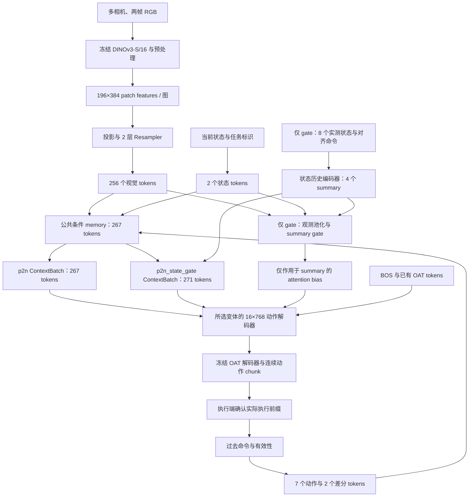

# Past2Next：p2n 与 p2n_state_gate 的 DINOv3-S/16 实现规范

文档日期：2026-09-24  
目标仓库：`/workspace/ysk/past2next_bug_fixed`  
状态：**待实现的技术规范；本文件的创建和更新不代表模型已经实现、训练或验证。**

交付变体：**`p2n` 与 `p2n_state_gate` 均为必需交付。**

## 1. 目标、范围与已确定的架构

将当前 Past2Next 升级为冻结的 DINOv3-S/16 视觉主干、可训练的空间 token 适配器，以及 16 层、768 维的自回归动作 Transformer。**同一套公共架构必须分别实现 `p2n` 和 `p2n_state_gate` 两个正式策略**，两者均使用 OAT/FSQ 动作 tokenizer、历史动作条件与 self-past 课程。

本轮只更新实现文档。后续实现交付两种明确的策略、各自的配置和 checkpoint，不展开额外的架构消融矩阵，也不把模型容量等同于已经验证的任务成功率。

### 1.1 两个必需变体

| 设计项 | `p2n` | `p2n_state_gate` |
|---|---|---|
| DINOv3-S/16、Resampler、16×768 AR、OAT | 使用公共设计 | 使用相同公共设计 |
| 两帧当前观测的本体状态与任务信息 | 包含 | 包含 |
| 过去 7 步动作与一阶/二阶命令差分 | 包含 | 包含 |
| 连续 8 个状态的额外历史输入 | 不要求 | 必须提供状态与有效性 |
| State-action history encoder | 不构造 | 构造，输出 4 个 summary |
| Summary gate 及其专用观测池化模块 | 不构造 | 构造，默认 learned，初始 0.9 |
| 默认条件 token 数 | **267** | **271** |
| self-past | 默认启用 | 默认启用 |
| 新策略的在线历史协议 | 执行确认后更新 | 执行确认后更新 |
| 配置、训练输出、checkpoint | 独立 | 独立 |

`p2n` 是完整的基础策略，不是把 `p2n_state_gate` 的 gate 设为 closed。后者仍有状态历史编码器、额外输入和 gate 相关结构；基础策略不得携带这些未使用模块，也不能要求补造状态历史输入。

这里“公共设计”指复用代码和冻结模型来源。两个变体分别训练其可训练参数、维护 optimizer/EMA，并各自保存 checkpoint；不要求两个已训练策略共享同一组可训练权重。

**执行协议的明确变化：** 现有旧 `p2n` 在预测后直接把计划执行前缀记入历史；新版两变体沿用上一版计划的执行确认契约，统一为 `record_executed_actions()` 后才更新历史。这是新版 `p2n` 的有意行为变化，复用现有 SelfPastExecuted 语义；旧策略与旧配置的更新时机保持原样。

### 1.2 两者共用的模型规格

| 模块 | 固定设计 |
|---|---|
| 视觉模型 | `facebook/dinov3-vits16-pretrain-lvd1689m`，约 21M 参数 |
| 视觉参数 | 冻结，共享用于所有相机和观测帧 |
| 图像尺寸 | 224×224；现有 128×128 图像重采样，不声称恢复额外细节 |
| DINO patch 输出 | 每张图 196 个 token，每个 384 维 |
| 视觉投影 | 384 → 768，可训练 |
| Resampler | 2 层，64 个 query，宽度 768，12 个头 |
| Resampler FFN | SwiGLU，中间维度 2048 |
| 动作解码器 | 16 层，宽度 768，12 个头，head dimension 64 |
| 动作解码器 FFN | SwiGLU，中间维度 2048 |
| 每层结构 | Pre-RMSNorm → causal self-attention → cross-attention → FFN，各子层带残差 |
| QK-Norm | 自注意力、交叉注意力均采用按 head feature 维度计算的 RMSNorm |
| 动作位置 | 可学习 OAT slot embedding，包含 BOS 位置 |
| 条件位置 | 视觉二维位置、相机身份、观测帧位置、历史相对时间、条件类型 |
| 输出 | 从 tokenizer 读取 latent 长度；现有配置通常 8 tokens → 16 步动作 |
| 执行 | 现有配置通常执行前 8 步；真机只记录实际执行的命令 |
| 门控 | 仅 `p2n_state_gate` 构造，保留现有 state-history summary gate 的含义 |
| 推理 | self-attention KV cache + 每个生成 chunk 内静态的 cross-attention KV cache |

动作解码器预计约 1.6 亿参数，Resampler、条件投影和 gate 变体的额外历史模块另计。必须对两个变体分别报告实际实例化后的总参数量、可训练参数量和冻结参数量；不能把解码器估算当作整套模型的精确规模。

动作模型从随机初始化训练，不直接加载 Qwen 的语言模型权重。Qwen 风格指借鉴组件设计；动作词表、OAT slot、条件交叉注意力和执行协议属于 Past2Next。

## 2. 已确认的工程现状

以下为文档编写时的只读检查结果，不代表已识别用户最终要启动的训练任务。

| 现状 | 对实现的影响 |
|---|---|
| 现有主配置多为 8 层、256 维动作模型 | 旧策略参数和 optimizer 不可直接作为新架构 resume |
| `FusedObservationEncoder` 返回 `[B, To, D]` | 不能只替换 `vision_encoder`；需要新的多 token 接口 |
| 现有模型已有 RMSNorm、SDPA、tied embeddings 和 KV cache | 复用正确行为，重点增加 SwiGLU、QK-Norm 和空间条件 |
| gate 代码按前 `n_obs_steps` 个 token 汇总观测 | 新布局必须通过显式 segment 获取观测 |
| gate 只屏蔽附加 history-summary | 不能改写成关闭全部历史信息 |
| workspace 存在策略 `isinstance` 判断 | 新策略必须保留行为兼容，或引入带旧实现兼容回退的能力接口 |
| 当前 DDP 使用 `find_unused_parameters=False` | 不得保留无用但仍可训练的旧模块 |
| 真实数据 RGB 为 byte-range，旧 RGB normalizer 服务于 ResNet | DINO 使用自己的预处理，避免重复归一化 |
| checkpoint 加载先构造 policy，再装载 state dict | 必须支持不下载外部权重的恢复构造路径 |

现有变体的行为来源也必须区分：

- `train_baseline.sh` 使用 `train_past2next_scratch`，对应 `Past2NextSelfPastPolicy`；原有基础 `p2n` 已经包含 self-past，不是 expert-only 配方。
- 旧 `Past2NextPolicy.predict_action()` 在有状态调用后提前记录计划执行动作；显式传入 `past_actions` 的调用不修改在线历史。
- 现有 state-history/gate 策略继承 SelfPastExecuted 路径，使用实际执行确认。新版 `p2n` 也采用这条执行语义，但不引入 gate 的状态历史模块。

任务配置必须区分：

- LIBERO 配方包含 500 条示范。检查时 `train_past2next_scratch_all500.yaml` 的实际 `val_ratio` 为 `0.1`，与名称及部分旧说明不一致。以 resolved config 和实际 episode masks 为准，不能根据 `all500` 名称推断没有验证集；不得静默改变划分。
- 真机 gate 配方默认 `pen_cabinet_lp3_N67`，67 条示范、两路 128×128 RGB、两帧观测、7 维动作；实际划分按其数据集配置确定。
- 真机状态包含位置、rot6d 姿态、夹爪状态及任务标识。四元数版本与 rot6d 版本不能共用错误的姿态解码。
- 真机配置没有模拟器 runner，离线验证不能报告为实际机器人成功率。

相关现有代码：

- [观测融合接口](../oat/perception/fused_obs_encoder.py)
- [原自回归模型](../oat/model/autoregressive/transformer_cache.py)
- [Self-past](../oat/policy/past2next_self_past.py)
- [状态历史策略](../oat/policy/past2next_state_history.py)
- [历史门控](../oat/policy/past2next_state_history_gate.py)
- [门控注意力实现](../oat/model/autoregressive/transformer_cache_history_gate.py)
- [真机 rot6d 适配](../oat/policy/past2next_state_history_gate_real_robot.py)
- [执行确认策略](../oat/policy/past2next_executed_past.py)
- [训练 workspace](../oat/workspace/train_policy.py)
- [checkpoint 加载](../oat/policy/base_policy.py)

## 3. 总体数据流



图中的两条 ContextBatch 路径由配置中的 `variant` 选择，每个策略实例仅构造自己的路径。`p2n` 不实例化图中的“仅 gate”节点。两者都保留独立的动作有效性缓存。

视觉 Resampler 和当前状态投影不能读取 history-summary。对于 gate 变体，历史摘要在动作解码器中融合，避免通过未受门控的视觉/状态 token 绕过 summary gate。实测状态历史由环境或控制端提供，不由预测动作伪造。

## 4. 文件与模块组织

以下名称是拟新增模块；除本文外，它们尚未因本次任务被创建。

| 拟新增文件 | 类或职责 |
|---|---|
| `oat/perception/dinov3_patch_encoder.py` | `DINOv3PatchEncoder`：加载、冻结、预处理、patch 提取 |
| `oat/perception/visual_resampler.py` | `VisualResampler`：投影后的 patch → 64 query tokens |
| `oat/perception/token_obs_encoder.py` | `TokenObservationEncoder`：多相机、多帧与本体状态编码 |
| `oat/model/common/context_batch.py` | `ContextBatch`、segment 枚举、验证和 attention bias 工具 |
| `oat/model/autoregressive/modern_transformer_cache.py` | `ModernAutoregressiveModel`、SwiGLU、QK-Norm、统一缓存路径 |
| `oat/policy/past2next_dinov3_common.py` | 公共 policy 核心：OAT、公共条件、self-past、执行历史及有效性 |
| `oat/policy/past2next_dinov3.py` | `Past2NextDINOv3Policy`，对应 `variant=p2n`；LIBERO/真机由观测 schema 配置 |
| `oat/policy/past2next_dinov3_state_gate.py` | `Past2NextDINOv3StateGatePolicy`，对应 `variant=p2n_state_gate`；增加 history encoder 和 gate |
| `oat/policy/past2next_dinov3_real_robot.py` | `Past2NextDINOv3RealRobotStateGatePolicy`：gate 变体的 rot6d 几何适配 |
| `oat/config/train_p2n_dinov3_s.yaml` | LIBERO 的 `p2n` 配方 |
| `oat/config/train_p2n_state_gate_dinov3_s.yaml` | LIBERO 的 `p2n_state_gate` 配方 |
| `oat/config/experimental/train_p2n_dinov3_s_real_robot.yaml` | 真机的 `p2n` 配方 |
| `oat/config/experimental/train_p2n_state_gate_dinov3_s_real_robot.yaml` | 真机的 `p2n_state_gate` 配方 |
| `train_past2next_dinov3_s.sh` | 支持 `--variant p2n\|p2n_state_gate` 与 `--task libero\|real_robot` 的独立 launcher |
| `tests/test_dinov3_*.py`、`tests/test_modern_ar_*.py` | 两变体的接口、梯度、缓存、恢复与执行契约测试 |

预计需要小范围适配的现有文件：

- `oat/policy/base_policy.py`：新策略 capability 默认值和恢复构造入口。
- `oat/workspace/train_policy.py`：按 capability 传递动作有效性，兼容验证调用，解析 warmup 步数和新 checkpoint 构造路径。
- 对应 dataset/runner：接通当前与前一窗口的动作有效性；基础策略使用执行确认 runner，gate 使用状态历史 runner。
- 现有历史与 self-past helper：尽量复用；如提取共享逻辑，旧策略必须通过相关回归检查。

`p2n` 的构造器只创建公共模块。`p2n_state_gate` 在公共模块上组合额外历史组件，不先创建一份旧 256 维 gate 模型再替换网络。每个配置显式写入 `variant` 并与 policy target 对照检查，不通过文件名或 token 数猜测类型。

旧模型与旧配置继续可用。不要覆盖旧 checkpoint，不在 module tree 中遗留任何未使用的可训练模块。

## 5. 权重获取与依赖

### 5.1 现有环境

只读检查中，`/venv/real_robot` 包含 Python 3.10.21、torch 2.10.0、torchvision 0.25.0、Transformers 4.57.6、Accelerate 1.12.0。该 Transformers 已提供 `dinov3_vit`。

实现优先使用现有 Transformers，不要求添加 timm，也不整体升级运行环境。实际开始实施时复核版本，并把版本写入训练元数据。

### 5.2 权重准备

1. 模型 ID 固定为 `facebook/dinov3-vits16-pretrain-lvd1689m`。
2. 核验模型访问权限；官方权重页面存在访问授权条件。
3. 获准后下载固定 commit revision，记录 revision 和权重摘要。
4. 预下载由单个准备进程执行；DDP ranks 从本地读取，避免同时下载。
5. 保存 DINO config、processor config 和权重，提供明确本地路径。
6. 权重缺失时给出可定位错误，不静默退化为随机 DINO，也不替换成本机现有 DINOv2-S。

当前已发现本机有 DINOv2-S/14 权重；这不能视为 DINOv3-S/16 已就绪。本次文档任务不尝试下载任何模型。

### 5.3 已选定的冻结 OAT tokenizer

用户指定两个变体共同使用以下 checkpoint：

```text
/workspace/ysk/past2next_bug_fixed/output/training/nut_washer_v3_N77_gated_so3aug_20260924_081008_317043427/tokenizer/checkpoints/ep-1540_mse-0.000.ckpt
```

2026-09-24 已通过 CPU 严格加载其中的 EMA 权重并检查结构；没有占用 GPU、更新权重或启动训练。

| 项目 | 已核验值 |
|---|---|
| Tokenizer 类 | `OATTokSO3Aug` |
| 本次使用的权重 | checkpoint 中的 EMA 权重；写入最终训练元数据 |
| 动作维度 / horizon | 7 / 16 |
| latent token 数 | 8 |
| FSQ levels | `[8, 5, 5, 5, 5]` |
| codebook / BOS / AR 词表 | 5000 / 5000 / 5001 |
| 编码器 / 解码器 | 2 层 / 4 层，内部宽度均为 256 |
| Parameter 元素数 | 5,804,854，包含 42 个 normalizer 参数元素 |
| FP32 权重与 buffer payload | 23,319,456 bytes，约 22.24 MiB；冻结后无梯度或 Adam 状态 |
| checkpoint 文件大小 | 92,965,527 bytes，包含训练状态，不能视为 GPU 占用 |

Tokenizer 的内部宽度 256 不限制新动作 Transformer 的宽度 768：两者通过离散 FSQ ID 连接。两个新策略均完整冻结 tokenizer，保留其 checkpoint 内的 action normalizer，向 `tokenize()` 提供正确语义的原始 7 维动作，避免重复归一化。

该 tokenizer 的 SO(3) augmentation 属于 tokenizer 训练 forward；冻结后的 `tokenize()` / `detokenize()` 路径不执行该随机增强。真机观测中的 rot6d 姿态与动作的 3 维旋转增量不是相同表示；不能把 7 维动作改成包含 6 维姿态的向量。目录名中的 gated 不意味着 tokenizer 自身包含 state-history gate。

此 checkpoint 固定用于本次 nut_washer 真机任务的两个变体。LIBERO 示例仍需要与 LIBERO 动作语义和 normalizer 匹配的 tokenizer；不因两者都是 7 维就自动复用这份真机权重。

## 6. DINO 输入与输出契约

### 6.1 输入契约

每个 RGB port 输入形状为 `[B, To, H, W, 3]`。`To` 通常为 2，port 顺序固定来自保存的 schema。

- 数据集默认输入为 `uint8`，范围 `[0,255]`。
- 如支持浮点 RGB，必须在配置中显式声明 `[0,1]` 或 `[0,255]`，不能按当前 batch 的最大值猜测。
- 不接受已经按旧视觉 normalizer 标准化的输入而不做区分。
- RGB/BGR 顺序在数据与部署边界检查；模型内部使用 RGB。
- 缺少必需相机时直接报错。第一版不引入未知相机的动态补零规则。

当前任务为正方形图像。默认保留完整视野并重采样到 224×224，使用固定的 antialias 插值设置。非正方形的新数据需要显式预处理配置，不能悄悄拉伸或裁掉工作区域。

读取并使用所选 DINO processor 的 rescale 与 mean/std；几何变换由本模块管理，避免 processor 再次 resize/crop。训练采用轻量光度增强，强度显式配置；不默认加入会改变动作几何含义的翻转或旋转。

验证、在线推理与 self-past 内部生成使用确定性图像处理。原始 128×128 图像上采样只增加采样网格，不创造原图没有的细节。

### 6.2 patch 提取

批量合并 batch、frame、camera 维度后执行视觉前向，但保留可逆的索引映射。

```text
输入图像：          [B × To × Nc, 3, 224, 224]
DINO patch features：[B × To × Nc, 196, 384]
恢复分组：          [B, To, Nc, 196, 384]
```

默认提取最后一层归一化后的 patch features。根据保存的模型配置排除 CLS 和 register tokens，不把固定切片的假设散落在多个调用处。DINOv3-S/16 当前含 4 个 register tokens，224 输入的总 token 数为 201，空间 patch 数为 196。

### 6.3 冻结与梯度边界

```python
# 伪代码：说明梯度边界，不是已实现 API。
with torch.no_grad():
    patches = frozen_dino(preprocessed_images)

projected = trainable_projection(patches)
visual_tokens = trainable_resampler(projected)
```

必须满足：

- `requires_grad=False` 只作用于 DINO 主干和 OAT。
- `.train()` 后 DINO 与 OAT 仍为 eval，投影、Resampler 与 AR 正常训练；history/gate 仅在 `p2n_state_gate` 中存在并正常训练。
- 不将整个 observation encoder 放入 `no_grad()`。
- 不直接把 `inference_mode()` 创建的 inference tensor 输入需要保存输入用于反传的可训练层；训练路径使用 `no_grad()`。
- self-past 临时进入推理模式后，完整恢复各可训练子模块的模式。
- 新模型初始化不能对预训练 DINO 递归调用重新初始化。

## 7. 视觉 Resampler

输入 patch 投影为 768 维后，加入对应 14×14 网格的二维位置编码。使用 64 个独立可学习 query，并保留 query slot 身份。

每个 Resampler block：

1. query 的 Pre-RMSNorm 自注意力；
2. query 对图像 patch memory 的 Pre-RMSNorm 交叉注意力；
3. Pre-RMSNorm + SwiGLU；
4. 各子层残差连接，attention 使用 QK-Norm。

两层 Resampler 对所有相机和帧共享参数。输出为每张图 `[64,768]`，相机 embedding 和观测帧 embedding 在形成最终视觉 memory 时加入。

64 个输出是可学习摘要槽位，不应宣称它们严格等同于固定的 8×8 图像像素格。二维 patch 位置仍然显式进入其读取过程。

```text
[B, To, Nc, 196, 384]
→ projection + spatial encoding
→ shared resampler
→ [B, To, Nc, 64, 768]
→ camera/frame encoding
→ [B, To × Nc × 64, 768]
```

不得把这些视觉 tokens 最终平均成两个向量后再交给动作模型。门控使用的 pooled observation 是 `p2n_state_gate` 专用的独立汇总路径，`p2n` 不构造这条可训练分支。

## 8. ContextBatch 与条件布局

### 8.1 类型契约

下列为拟实现的数据结构契约。`valid_mask=True` **统一表示该 token 可以被 attention 读取**。

```python
@dataclass
class ContextBatch:
    memory: Tensor                         # [B, N, 768]
    valid_mask: Tensor                     # bool [B, N], True = visible
    segment_ids: Tensor                    # int64 [N]，本批次共享布局
    observation_summary: Tensor | None     # gate: [B, 768]；p2n: None
    history_summary_pool: Tensor | None    # gate: [B, 768]；p2n: None
    history_valid_fraction: Tensor | None  # gate: [B, 1]；p2n: None
    history_log_gate: Tensor | None        # gate: [B, 1]；p2n: None
```

`p2n` 的四个 summary/gate 字段均为 `None`，不生成占位 summary，不执行 gate 专用池化。公共 decoder 在 `history_log_gate=None` 时只应用 padding bias，summary bias 为零。

`p2n_state_gate` 必须填充上述字段，并明确建立 `HISTORY_SUMMARY` segment；观测汇总只由视觉和当前观测状态产生。若样本没有有效历史转移，当前状态仍需有效；summary 有效性与 gate 输入按现有最短历史规则处理，不能把填充当作实测值。当前观测的状态历史全无效时应报错；无效 previous window 则在 self-past 生成前筛除。

公共 attention 层内部统一转为 additive bias，避免混淆 SDPA 与其他 PyTorch API 对布尔 mask 的不同解释。不能再使用 `cond[:, :n_obs_steps]` 或未经声明的“最后若干个 token”推断语义；所有消费者通过 segment 获取数据。

### 8.2 两变体的默认 layout

两相机、两观测帧、7 个过去动作时：

| Segment | `p2n` 数量 | `p2n_state_gate` 数量 | 编码 |
|---|---:|---:|---|
| `VISUAL` | 256 | 256 | 空间、query slot、相机、帧位置 |
| `PROPRIO` | 2 | 2 | 每观测时刻的本体状态与任务信息，投影到 768 |
| `RAW_ACTION` | 7 | 7 | 每条过去命令独立投影、类型与相对时间 |
| `ACTION_DIFF` | 2 | 2 | 一阶和二阶命令差分，独立类型标识 |
| `HISTORY_SUMMARY` | **0，不存在** | 4 | 状态/动作历史摘要，投影到 768 |
| 合计 | **267** | **271** | 分别保存 schema |

`task_uid` 已包含在本体状态/任务特征构造中，不额外增加一个未声明的 token。两种 layout 都是正式支持的默认布局。

相机数、观测步数改变时，由 layout builder 计算 N，不硬编码 267 或 271。基础策略的 summary 数必须是 0，gate 配方默认是 4；构造时校验 variant 与布局的一致性。动作解码器不依赖旧 `max_cond_len=11/15`。

### 8.3 状态与历史归一化

- 观测状态使用当前训练集拟合的 normalizer。
- OAT 继续使用自身 checkpoint 中的 action normalizer。
- 历史动作使用策略对应的 action normalizer，沿用当前语义。
- 无效历史在归一化及几何变换前清理，在 memory 构造后再次通过 mask 屏蔽，避免线性 bias/位置 embedding 使填充成为可见信息。
- 不能用“动作向量是否为零”判断有效性，真实零命令也可能有效。
- 一阶命令差分要求最近两个命令有效；二阶差分要求最近三个有效。
- `acc/jerk` 旧命名对应命令差分，不将所有动作维度解释为严格物理加速度或 jerk。

### 8.4 状态历史，仅适用于 p2n_state_gate

`p2n` 不调用本节的编码器；它仍保留两帧当前观测的状态输入和 7 步历史动作条件。

`p2n_state_gate` 复用现有历史编码器的 8 个状态与 7 条命令对齐、连续有效后缀、转移 mask 和 summary 生成方式，保留其独立的小型内部宽度；最终输出投影到 768。

真机继续使用 `Rotation6DStateActionHistoryEncoder` 的布局和 FP32 几何计算。无效旋转在几何运算前按现有规则填 identity，不能让随机 padding 或 NaN 进入旋转计算。

## 9. 历史 gate 的完整语义，仅适用于 p2n_state_gate

本节全部模块和 gate 模式只属于 `p2n_state_gate`。`p2n` 不接受用于启用额外结构的 gate 开关；将 gate 变体设为 closed 也不会转换为基础变体。

门控输入由显式观测汇总、历史摘要汇总和历史有效比例组成。观测汇总先分别汇总各相机/帧视觉信息，再与本体状态融合，避免 256 个视觉 token 以数量淹没 2 个状态 token。

沿用 hidden dimension 128、初始 gate 0.9 的设计。三个模式继续存在：`learned`、`open`、`closed`；后两者用于正确性检查，不构成架构消融计划。

```text
learned: log_gate = logsigmoid(gate_logits)
open:    log_gate = 0
closed:  log_gate = -inf
```

cross-attention scores：

```text
scores = Q_norm @ K_norm.transpose(-1, -2) / sqrt(head_dim)
scores += padding_bias
scores += summary_gate_bias
```

- `padding_bias` 对所有无效条件 token 为 `-inf`。
- `summary_gate_bias` 只在 `HISTORY_SUMMARY` segment 写入 log_gate，其他位置为 0。
- 使用 masked assignment/where 构造 bias，不计算 `-inf * 0`。
- `closed` 仍允许读取 RAW_ACTION 和 ACTION_DIFF。
- 视觉与当前状态编码器不得提前读取 history-summary。
- 所有 batch 样本必须至少有一个可见观测 token，避免整行 attention 被屏蔽。
- gate 为闭合时，不能由于位置 embedding、bias 或条件缓存重新引入 summary 信息。

新注意力直接支持该 bias。不要继续维护一份绕过基础 attention 的手写 gate forward，否则容易漏掉 QK-Norm 或缓存处理。

## 10. 动作解码器实现要求

### 10.1 子层

```text
x = x + SelfAttention(RMSNorm(x), causal=True)
x = x + CrossAttention(RMSNorm(x), context)
x = x + SwiGLU(RMSNorm(x))
```

SwiGLU：`down(silu(gate(x)) * up(x))`，三个 bias-free 投影，宽度 768、中间维度 2048。不能仅将旧 GELU 改为 SiLU 而保留两层 FFN。

QK-Norm 位于 Q/K projection 和 head reshape 之后，按最后一个 64 维轴计算 RMSNorm。使用 float32 累加计算 norm 后转回 activation dtype。保留 `1/sqrt(64)` scaling，V 不进行同样的 QK 归一化。

主 attention 使用 12 个 Q/K/V heads；本次不增加 GQA、MoE 或其他未确定结构。dropout 在 eval 下关闭。

### 10.2 OAT 词表与 slot

- `vocab_size = tokenizer.codebook_size + 1`。
- `bos_id = tokenizer.codebook_size`。
- latent token 数、action horizon 和 action dimension 从 tokenizer/config 验证获取。
- token embedding 与 output head 共享同一个 Parameter，optimizer 与 EMA 都需去重。
- 动作位置使用 learned slot embedding，不新增动作侧 RoPE；DINO 内部位置实现保持原样。

若目标为 `z0 ... z7`，训练输入为 `[BOS, z0 ... z6]`，输入位置为 `0 ... 7`，分别预测 `z0 ... z7`。生成 BOS prefill 使用位置 0，此后新输入 token 的位置按已处理前缀长度推进。

### 10.3 初始化

对新动作网络使用显式、适合深层残差网络的初始化，并让所有残差输出投影采用一致的深度缩放规则。记录初始化方案；不要让模型新增模块的创建顺序意外覆盖预训练参数。

`p2n_state_gate` 的 gate 最后一层零权重和对应 0.9 概率的 bias 保持现有设计；`p2n` 不执行 gate 初始化。两变体的新模型随机种子由各自训练配置控制。

## 11. 训练、self-past 与公开 policy 接口

### 11.1 共用条件构造入口与变体扩展

以下所有路径调用所属策略的同一个 `build_context()`、同一 decoder 和同一 mask/gate 工具：

1. 普通训练 forward；
2. expert-history 离线验证；
3. generated-history 离线验证；
4. 生成 previous window 的 self-past 路径；
5. 在线 `predict_action()`；
6. 显式给定 `past_actions` 的无状态验证。

公共核心先生成视觉、当前状态、raw-action 和 action-diff segments。`p2n` 到此结束，默认返回 267 tokens；`p2n_state_gate` 扩展同一结果，增加 4 个 summary 和 gate 数据，默认返回 271 tokens。不得在旧 `_build_condition`、`_condition`、`_condition_and_gate` 和 `_generate_actions` 中分别维护不同版本的新布局。

### 11.2 接口清单与有效性

| 接口 | 两变体共同的行为或差异 |
|---|---|
| `forward(batch, history_mode=None)` | 交叉熵目标，支持 expert/generated/configured 历史模式 |
| `build_context(obs, past_actions, past_action_valid)` | 两者都显式接收动作有效性；gate 从 obs 额外读取状态历史 |
| `predict_action(obs_dict, ..., past_actions=None, past_action_valid=None)` | 返回连续动作与完整预测 chunk；显式历史与有效性一起传递 |
| `record_executed_actions(actions, executed_lengths=None)` | 两者只提交实际执行前缀并推进动作有效性 |
| `reset()` | 清除 episode 执行历史、有效性和 pending 状态 |
| `on_optimizer_step()` | 成功 optimizer update 后推进课程 |
| `set_normalizer()` | 设置状态/策略 normalizer，不覆盖冻结 tokenizer 统计 |
| `get_optimizer()` | 当前变体实际构造的可训练参数恰好进入一个参数组 |
| `get_observation_encoder()` | 返回 token observation encoder，供调用端检查和模式管理 |
| `get_observation_modalities()` | 返回当前变体实际支持的观测模态 |
| `get_observation_ports()` | p2n 只声明普通观测端口；gate 额外声明状态历史和有效性端口 |
| `get_policy_name()` | 返回包含 `p2n` 或 `p2n_state_gate`、视觉架构及任务的信息 |
| `create_dummy_observation()` | 生成当前变体所需的合法输入；p2n 不生成状态历史占位字段 |

`past_action_valid` 与 `prev_past_action_valid` 来自 dataset 顶层，不能依赖只有 gate 数据集提供的 `obs["state_history_valid"]`。它们分别对应当前和前一窗口的 7 步动作，形状为 bool `[B, 7]`；进入公共条件构造、命令差分和 self-past 生成路径。

新策略的显式历史调用要求 `past_actions` 与匹配的 `past_action_valid` 成对提供；缺少 validity 时给出明确错误，不通过值是否为零或默认全有效猜测。两者都未提供时使用在线历史及其有效性缓冲区。旧策略维持原接口，通过 capability resolver 避免向不支持的调用传入新参数。

gate 变体同时使用状态历史 validity；状态和动作窗口长度不同，按时间索引构造转移 mask，不直接把两种 mask 当作相同形状。`p2n` 不需要构造 8 个状态来获取动作有效性。

### 11.3 workspace、数据与 runner

新策略采用独立 `BasePolicy` 公共实现，组合 self-past 调度和执行历史 helper。gate 变体额外组合现有历史编码器；避免机械继承旧 gate 构造器对 `cond_pos_emb` 等内部字段的假设。

在 workspace 和 runner 使用统一 capability resolver。拟采用以下类属性，基类默认均为 `None`：

| Capability | `p2n` | `p2n_state_gate` |
|---|---|---|
| `supports_explicit_past_actions` | True | True |
| `supports_explicit_past_action_valid` | True | True |
| `supports_generated_history_validation` | True | True |
| `requires_execution_acknowledgement` | True | True |
| `requires_state_history` | False | True |
| `supports_history_summary_gate` | False | True |

属性为明确 bool 时使用该值；属性缺失或为 `None` 时，回退旧策略现有类型/接口判断。对新增 validity 参数，只有明确支持或已确认签名支持才传入。**不能在 BasePolicy 默认设置 False 后，仅依靠 getattr 的默认参数回退**，因为继承到的 False 会静默关闭旧策略能力。分别测试显式声明、旧策略回退和显式禁用。

| 任务 | `p2n` 数据集 / runner | `p2n_state_gate` 数据集 / runner |
|---|---|---|
| LIBERO | `ZarrDatasetWithPrevWindow` / `LiberoExecutedPastRunner` | `ZarrDatasetWithStateHistory` / `LiberoStateHistoryRunner` |
| 真机 | `RealRobotZarrDatasetWithPrevWindow` / 无模拟器 runner | `RealRobotZarrDatasetWithStateHistory` / 无模拟器 runner |

两种数据集都配置 `history_padding: zero` 与 `return_history_validity: true`，提供 previous-window 信息支持 self-past。gate 数据集额外提供当前与 previous window 对齐的状态历史。真机控制端对两者都调用执行确认接口，但只为 gate 变体维护额外状态历史输入。

复用的 dataset `_target_` 分别为：

- LIBERO p2n：`oat.dataset.zarr_dataset_with_prev_window.ZarrDatasetWithPrevWindow`。
- LIBERO gate：`oat.dataset.zarr_dataset_with_state_history.ZarrDatasetWithStateHistory`。
- 真机 p2n：`oat.dataset.real_robot_dataset.RealRobotZarrDatasetWithPrevWindow`。
- 真机 gate：`oat.dataset.real_robot_state_history.RealRobotZarrDatasetWithStateHistory`。

LIBERO runner `_target_` 分别为 `oat.env_runner.executed_action_runner.LiberoExecutedPastRunner` 与 `oat.env_runner.state_history_runner.LiberoStateHistoryRunner`；两者须适配 capability 路由。真机两配置的 `env_runner` 均为 null。

在当前决策时刻 t，7 条命令覆盖 `[t−7,t)`，8 个状态覆盖 `[t−7,t]`。gate 离线数据集检查连续窗口的动作有效性与 `state_history_valid[:, :-1] & state_history_valid[:, 1:]` 一致；previous window 做对应检查。此检查只比较对齐的 7 个转移，不能将动作 mask 与 8 个状态的 mask 直接判等。

提取共享 helper 不改变旧策略的 forward 结果或历史更新时机。旧类型检查涉及的 validation、sample reconstruction、dummy obs 和 runner 路径均需逐项核对。

### 11.4 self-past，两变体均默认启用

- `p2n` 只需要 previous observation、动作历史及有效性；gate 额外使用该窗口实际对齐的状态历史，不把生成命令积分成虚构的实测状态。
- 保留从 previous observation/window 生成历史命令的现有算法。
- offline self-past 仍使用示范观测和示范动作目标；不是环境闭环 rollout。
- synthetic 命令替换后重新计算命令差分；有效性来自真实窗口元数据，不从预测值推断。
- `prev_window_valid=False` 的样本必须在 previous-window 推理前筛除，不生成虚构的前一窗口；其 previous 状态 mask 可能全 False，不可先送入要求当前状态有效的 history encoder 再屏蔽结果。
- self-past 生成期间关闭所有可训练模块的 dropout/随机视觉增强，之后恢复模式。
- 保留现有 `_clean_autocast_cache()` 的语义：嵌套的推理生成前后清理 autocast weight cache，防止外层 BF16 训练复用在 `inference_mode()` 内生成的参数 cast。此要求覆盖共享的 decoder、Resampler 和投影，不仅是 DINO。
- 在退出内部 `inference_mode()` 后，对生成动作执行 `detach().clone()`，再将其作为可训练历史投影的输入。不得让 inference tensor 经由 synthetic history 进入需要保存输入的反向传播路径。
- 课程只按成功 optimizer updates 前进，不按 microbatch、验证 forward 或被跳过的更新前进。
- 分块生成 self-past 以控制显存；分块必须保持原样本索引和有效性对齐。

## 12. KV cache 与执行历史

### 12.1 两种不同状态

| 状态 | 生命周期 |
|---|---|
| Transformer KV cache | 一次动作 chunk 的 token 生成；新观测到来后重建 |
| 已执行命令历史 | 跨策略调用保持；只由执行确认更新，episode reset 清空 |

不得把上一观测下的 cross-KV 或 action self-KV 延续到新观测下。不得把尚未执行的预测动作直接写入已执行历史。

### 12.2 注意力缓存

- 每层 cross-KV 在本 chunk 内只预计算一次；缓存 K 已经过该层 K-Norm，V 保留正常投影结果。
- self-cache 存经过 K-Norm 的 K；本设计动作端没有 RoPE，不需要旋转 cache。
- 普通前向、prefix prefill、单 token decode 共用 Q/K 处理函数。
- 单 token decode 已有全部可见过去 cache 时，不机械使用非方阵 `is_causal=True`；保持所有历史可见。
- 如支持一次增量输入多个 token，显式构造带 prefix offset 的 causal mask。
- padding/gate bias 对训练和 cached generation 一致。
- 缓存不保存 autograd graph，不进入模型 checkpoint。

### 12.3 执行协议

本节适用于两个**新**变体。`predict_action()` 返回预测，不自动提交历史；执行端随后调用 `record_executed_actions()`，提供实际执行命令及每个环境的实际长度。旧 `p2n` 的自动记录预测前缀行为不因新增模型而改变。

两者维护 `[B, 7, action_dim]` 的动作历史及 bool `[B, 7]` 的有效性。reset 将有效性设为 False；每次确认仅按实际执行长度推进，并将真实提交的命令标记有效。零执行不添加有效历史；真实零命令仍标记为有效。不得在 `p2n` 中借用不存在的状态历史 mask 替代该缓冲区。

必须处理部分执行、零执行、不同环境执行长度、pending acknowledgement、batch 变化和 episode reset。存在 pending 时不得静默覆盖未确认预测；batch 变化要求显式 reset。显式 `past_actions` 与 validity 的离线调用不改变在线历史、有效性及 pending 状态。

`p2n_state_gate` 的每控制步实测状态历史仍由调用端提供，并与确认命令对齐。`p2n` 只使用正常观测窗口中的状态，不要求该额外历史序列。

## 13. 训练配方与资源

### 13.1 Stage 1 / Stage 2

复用匹配任务、动作语义和数据划分的 OAT checkpoint，不因更换视觉主干而重新定义 tokenizer。

Stage 2 为两个变体分别创建训练任务：使用相同来源的预训练 DINO/OAT，新初始化 AR/adapter；仅 gate 变体初始化 history/gate。各自使用 fresh optimizer、EMA 和 self-past 计数。旧策略 checkpoint 不进入 `resume` 或宽度不匹配的宽松加载；两变体之间也不能互相当作 resume。

若 tokenizer 的动作维度、horizon、归一化来源或 latent 配置不匹配，启动前报错，不能通过截断或 reshape 静默修复。

### 13.2 优化器与调度

| 项目 | 初始配方 |
|---|---|
| Optimizer | AdamW |
| Decoder / 条件与历史模块 LR | `5e-5` |
| 视觉投影 / Resampler LR | `1e-4` |
| Betas | `(0.9, 0.95)` |
| Weight decay | `0.01`，bias 与归一化参数为 0 |
| Dropout | 新模型模块 `0.1`；冻结 DINO eval |
| Precision | BF16 autocast，几何/norm 等必要计算保留 FP32 |
| Gradient clipping | `1.0` |
| Scheduler | cosine，warmup 为计划 optimizer updates 的 5% |
| 有效 batch | 64 |
| 单卡起始 microbatch | 8 |
| 单卡 gradient accumulation | 8 |
| 本次双卡起点 | 每卡 microbatch 8，world size 2，gradient accumulation 4 |
| EMA | 复用现有实现及其 schedule |
| Self-past schedule | optimizer-step；warmup 1000，ramp 4000，最大概率 0.5 |
| Seed | 默认 42，写入完整配置 |

这些是待运行的工程初值，不是实测最优结果。

优化器以 Parameter 对象身份去重，冻结参数不进入参数组。动作 embedding/head 共享权重只处理一次。Resampler、slot/type/camera/time embeddings 的可训练参数都必须被覆盖；gate 变体还需覆盖 history、gate 及其专用池化参数。p2n 的参数组不得包含任何额外历史编码器或 gate 参数。

总 update 数应按实际分布式 dataloader、gradient accumulation、epoch 上限及有效的 `max_train_steps` 解析，处理 epoch 尾部的累积批次。scheduler、warmup 和日志必须使用同一更新计数规则。第一版启动器可解析后传入整数 `lr_warmup_steps`，不得把一个尚未被 workspace 使用的 ratio 字段当作已经生效。

LR warmup 与 self-past warmup 是两套独立计数用途，不能互相覆盖。记录 self-past temperature/top-k，并沿用所选任务的生成设置。

### 13.3 数据与训练长度

两变体各自提供 LIBERO 与真机配置，共四个可解析的训练入口。对相同任务复用同一套明确的 episode 划分与 normalizer 统计边界，分别解析各自 dataset 所需字段。维持各自 episode 级划分、seed 和 normalizer 的训练集边界，不随机按帧重划分。启动时检查 resolved `val_ratio`、实际 train/validation episode masks 与验证开关是否一致；当前 `all500` 配方也不能跳过此检查。若显式选择没有验证集的配方，报告其无留出验证，不能将训练集指标命名为验证指标。

本次已选 tokenizer 对应 `/workspace/ysk/zarr/nut_washer_v3_N77.zarr`、77 条示范、`val_ratio=0.05`、seed 42。配套策略配置为两路 128×128 RGB、两帧观测、16 步动作 horizon、执行 8 步、7 个历史动作和 8 个状态历史。两个新变体复用该任务的数据边界；不能套用通用 90/10 示例或依据残留的 pen_cabinet 配置名称选错数据。启动时仍须核对实际 episode masks 与冻结 tokenizer 的归一化来源。

epoch 上限明确沿用被选中的任务配方并打印；不能同时混用普通真机 launcher 的 1001-epoch 默认值和 gate 配置的 2001-epoch 默认值。用户提供的显式命令行覆盖优先于配方默认值。

保留必要的验证、最新恢复点与指定周期 checkpoint。checkpoint 频率与保留策略显式配置，不能由旧 launcher 的名称分支悄悄改成保存全部。

### 13.4 两张 RTX 4090 的训练可行性

**结论：按已选 tokenizer 和本规范模型规模，两张 24GB RTX 4090 预计足以训练 p2n 与 p2n_state_gate，无需缩小 16×768 AR 或 64-query Resampler。** 这是实际硬件检查、tokenizer 加载和模型结构计算得到的可行性判断；新模型尚未实现，当前没有完整模型的实测峰值显存、训练速度或收敛结果。

本次只读检查到 8 张 RTX 4090。GPU 0/1 有其他任务；GPU 2/3 各约 23.54 GiB 空闲、利用率 0%，且位于同一 NUMA 节点，可作为后续双卡候选。GPU 4–7 当时也空闲。此状态随时间变化，不代表已预留 GPU；启动前重新核对，不停止已有任务。

采用 DDP，一卡一个 rank，每张卡保有完整的模型、optimizer 和 EMA。**两张 24GB 卡不会合并为单个 48GB 显存池**，因此每个 rank 的峰值都必须落在单卡预算内。参见 [PyTorch DDP 文档](https://docs.pytorch.org/docs/stable/generated/torch.nn.parallel.DistributedDataParallel.html)。

两变体默认先后使用双卡分别训练，不把两者的参数或 optimizer 混为同一个模型：

| 方案 | 每卡 microbatch | world size | 梯度累积次数 | 有效 batch |
|---|---:|---:|---:|---:|
| 双卡推荐起点，各变体独立运行 | 8 | 2 | 4 | 64 |
| 双卡更保守起点 | 4 | 2 | 8 | 64 |
| 若另行选择同时训练，每个变体独占一卡 | 8 | 1 | 8 | 64 |

单卡同时运行两个独立训练不属于推荐安排。上表各方案均需完成实际峰值检查后再长时间运行；优先使用双卡推荐或保守配方。

```text
effective_batch = microbatch × world_size × accumulation = 64
```

按 bias-free attention、SwiGLU 和 tied 5001×768 embedding 估算，16×768 动作解码器约 154.9M 参数，两层 Resampler 及视觉投影/查询/空间编码约 19.4M，公共可训练核心约 174.3M；条件投影与 gate 变体额外模块另计。gate 仅增加 4 个条件 tokens（267 → 271）与小型历史编码器，两变体的显存需求预计接近。

当前训练使用 BF16 autocast，参数、梯度、Adam 状态和 EMA 仍按 FP32 预算。公共核心每卡的基础状态估算如下：

| 项目 | 估算 GiB / 卡 |
|---|---:|
| FP32 参数 | 0.65 |
| FP32 梯度 | 0.65 |
| Adam 一阶与二阶矩 | 1.30 |
| EMA 参数 | 0.65 |
| 公共核心基础状态合计 | **约 3.25** |

上述合计**不是完整峰值显存**。还需要冻结 DINO/OAT 及其 EMA 副本、额外条件模块、BF16 casts、DDP buckets、训练激活、SDPA workspace 和临时张量。已选 tokenizer 单份 FP32 tensor payload 仅约 22.24 MiB，按当前 deepcopy EMA 方式保留两份也约 44.48 MiB，不是主要显存开销。

以每卡 batch 8 估算，16 层的 BF16 静态 cross-KV cache 数据量约为 p2n 100 MiB、gate 102 MiB。动作自回归序列只有 8 tokens；需要重点控制的是 2 帧 × 2 相机的视觉适配器激活，以及 self-past 内部第二次视觉/动作生成。

实现与验证要求：

- DINO 和 tokenizer 始终冻结并 eval，adapter、Resampler、AR 及 gate 变体的历史模块正常反传。
- self-past 建议以每卡 4 个样本分块生成；该分块控制为待实现的新功能，不能只添加未被读取的配置字段。
- 现有 self-past 在全部有效 previous windows 上生成后再按概率混合，不能把生成显存按概率 0.5 直接减半。
- 新实现优先先完成 previous-window 无梯度生成并释放临时 cache，再构建当前窗口训练图，避免不必要的峰值叠加；保持随机增强、模式恢复和 autocast cache 的既定契约。
- 必须测量 Adam 状态建立后的正常训练、自带有效 previous windows 的 self-past、expert/generated validation，并分别记录 `max_memory_allocated` 与 `max_memory_reserved`。不能只测 self-past warmup 前的第一个 batch。
- validation 从每卡 batch 4 开始，避免旧 launcher 把它覆盖为 32；正式记录验证 batch 与生成分块大小。
- 若峰值接近单卡容量，先将 microbatch 从 8 降为 4、累积从 4 提到 8。必要时实现 decoder/Resampler activation checkpointing，以额外重算换取显存；该功能目前尚未实现，参见 [PyTorch checkpoint 文档](https://docs.pytorch.org/docs/stable/checkpoint.html)。
- activation checkpointing 保持 dropout RNG 一致，只用于无 KV cache 的训练前向。资源调整保留 16×768 与 64 visual queries 的架构规格。
- 正式长跑前，两变体分别完成真实 DINO/OAT 的单卡训练 step、双 rank 通信与 self-past smoke；建议峰值 reserved 至少留出约 2 GiB 余量，再选择长跑 batch。

本次可行性检查未下载 DINO、未运行 GPU probe、未修改实现代码或启动训练。完整实现后的峰值测量是最终 batch 验收依据。

## 14. 初始化、恢复与离线部署

### 14.1 三条独立加载路径

1. **Fresh training**：从获准本地 DINO 权重和指定 OAT checkpoint 加载冻结模块；初始化新可训练模块。
2. **Training resume**：从相同 variant、任务输入 schema 和架构的完整训练 checkpoint 恢复模型、EMA、optimizer、scheduler、计数和 RNG。
3. **Deployment load**：从配置构造架构，严格加载推理权重，完全离线工作。

现有 `BasePolicy.from_checkpoint()` 在 `load_state_dict` 前 instantiate policy；新加载路径必须在 instantiate 前选择 `restore` 构造模式。

**DINO 和 OAT 都需要无外部文件依赖的恢复构造。** 只解决 DINO 的联网下载问题还不够：如果构造器仍调用原路径的 `OATTok.from_checkpoint()`，移动整个 policy checkpoint 后仍可能失败。

因此完整 artifact 应包含构造两个冻结模块所需的结构配置，以及它们的模型权重和 normalizer；restore 模式只建立结构，再从完整 state dict 恢复。禁止在 strict load 前以外部 pretrained 文件是否存在作为隐藏前提。

### 14.2 必须记录的元数据

- `variant=p2n` 或 `variant=p2n_state_gate`、policy target、任务类型和执行协议版本；
- DINO 模型 ID、精确 revision、结构配置、权重摘要；
- processor 参数、RGB 数值范围、相机排序和图像几何处理；
- OAT 结构配置、来源摘要、词表大小、latent 长度和冻结 normalizer；
- decoder 与 Resampler 配置、初始化规则；
- ContextBatch schema version、segment 定义和相机/frame/slot 编码方式；
- 动作语义、horizon、执行步数、rot6d rows/columns 布局；
- 数据路径标识、episode 划分、seed 和 normalizer 来源；
- optimizer 参数组、scheduler 状态、EMA 状态、成功 optimizer updates；
- self-past 计数、配置、epoch/global-step 和随机数状态；
- 软件版本与相关源码版本。

恢复前校验 variant 与 ContextBatch schema；p2n 与 gate checkpoint 相互加载时必须报错，不能用 `strict=False` 隐藏缺失或多余模块。p2n artifact 不包含 gate/history-encoder 参数，gate artifact 必须包含这些参数及几何配置。跨变体迁移训练不属于本次默认恢复流程。

self-cache、cross-cache、在线执行历史、动作有效性和 pending acknowledgement 不作为跨 episode 推理状态自动恢复。模型加载后进入 eval，并通过 reset 建立新的在线会话。

### 14.3 EMA

复用已有 tied-parameter 去重处理。确认冻结 DINO/OAT 参数在 EMA 中保持相同，normalizer 与必要 buffers 正确恢复。

第一版优先保证完整 artifact 和恢复正确，不为了节省 checkpoint 大小过早拆分多个具有隐式路径依赖的权重包。

## 15. 配置与 launcher 的验收契约

### 15.1 四个必需配置入口

| 任务 | Variant | 配置路径（相对 `oat/config/`） | Policy 类 |
|---|---|---|---|
| LIBERO | `p2n` | `train_p2n_dinov3_s.yaml` | `Past2NextDINOv3Policy` |
| LIBERO | `p2n_state_gate` | `train_p2n_state_gate_dinov3_s.yaml` | `Past2NextDINOv3StateGatePolicy` |
| 真机 | `p2n` | `experimental/train_p2n_dinov3_s_real_robot.yaml` | `Past2NextDINOv3Policy` |
| 真机 | `p2n_state_gate` | `experimental/train_p2n_state_gate_dinov3_s_real_robot.yaml` | `Past2NextDINOv3RealRobotStateGatePolicy` |

配置可以引用公共 defaults，但最终 resolved config 必须完整可读。`variant`、policy target、dataset、runner、是否需要状态历史必须相互一致。基础真机策略通过 schema 使用 rot6d 当前观测特征，不创建 gate 专用的状态历史几何编码器。

`p2n` 配置不包含用于启用 history encoder/gate 的参数，summary 数由变体约束为 0；gate 配置显式保存 `history_num_states=8`、`num_summary_tokens=4`、history encoder 参数及 learned gate 初值。两者均显式启用 self-past 和执行确认。

### 15.2 Launcher 行为

新 launcher 必须：

- 要求选择 `--variant p2n` 或 `--variant p2n_state_gate`，并选择 `--task libero` 或 `--task real_robot`；映射到上表中的配置，不根据名称包含 gate 与否覆盖训练超参数；
- 两变体各自使用独立输出目录、日志 run name 和 checkpoint 路径，元数据中明确 variant；
- fresh training 校验外部 tokenizer、本地 DINO、数据 schema 和输出目录；
- resume 校验 artifact 的 variant、结构配置、冻结权重、训练状态与当前数据 schema，不重新要求原 DINO/OAT 外部路径；deployment load 同样只依赖自包含 artifact；
- 原样透传用户的 batch、accumulation、epoch、checkpoint 和设备覆盖；
- 打印完整 resolved config、参数分组、可训练/冻结参数量、条件布局及计划 update 数；
- fresh training 默认 `resume=false`、不加载旧 policy 初始化；
- resume 必须显式指定兼容 checkpoint，拒绝跨 variant 恢复；
- 正式训练前完成依赖与权重检查；
- 真机任务不构造不存在的模拟器 runner；
- 不在训练中临时自动换模型版本或升级依赖。

### 15.3 两变体的启动示例

以下仅为**拟实现后的 launcher 命令接口示意，目前不可视为已可执行**。launcher 负责将 `--variant`、`--task`、`--tokenizer`、`--dino`、`--output` 映射为对应配置字段，将 `--` 后的参数作为 Hydra overrides 原样传递。Python 环境由 launcher 的显式选项或环境配置确定，不把真机环境当作所有任务的固定依赖。

```bash
# LIBERO：基础 p2n
bash train_past2next_dinov3_s.sh \
  --variant p2n --task libero \
  --tokenizer /path/to/frozen_tokenizer.ckpt \
  --dino /path/to/dinov3_s_snapshot \
  --output output/training/p2n_dinov3_s_libero_seed42 \
  -- dataloader.batch_size=8 \
     training.gradient_accumulate_every=8 \
     training.resume=false logging.mode=offline

# LIBERO：状态历史 gate 变体
bash train_past2next_dinov3_s.sh \
  --variant p2n_state_gate --task libero \
  --tokenizer /path/to/frozen_tokenizer.ckpt \
  --dino /path/to/dinov3_s_snapshot \
  --output output/training/p2n_state_gate_dinov3_s_libero_seed42 \
  -- dataloader.batch_size=8 \
     training.gradient_accumulate_every=8 \
     training.resume=false logging.mode=offline
```

真机分别使用相同的两个 variant 名称与 `--task real_robot`，加载对应真机配置、数据和 tokenizer，输出目录分别使用 `p2n_dinov3_s_real_robot_seed42` 与 `p2n_state_gate_dinov3_s_real_robot_seed42`。不得沿用 LIBERO 的动作或姿态 schema。

正式交付时按实际 Hydra schema 更新示例，并为上表四种组合各提供一条经过配置解析及 smoke 验证的命令。完整任务训练使用用户选择的数据和设备，不因提供四个入口就自动并行启动四个训练。

## 16. 实现顺序与阶段出口

| 阶段 | 工作 | 完成条件 |
|---|---|---|
| A | 固定环境、权重 revision、两变体的数据与 tokenizer schema | 四配置映射明确，依赖与加载前置条件可定位 |
| B | 公共 DINO patch encoder 与预处理 | shape 正确，冻结与确定性行为正确 |
| C | Resampler、公共 ContextBatch 与基础 p2n | 256 visual / 267 total；不提供状态历史也可构造与前向 |
| D | 现代 AR 与统一 attention/cache | 基础策略 full-forward 和 cached logits 一致 |
| E | gate 变体的 history encoder、4 summaries 与 gate | 271-token layout 正确，额外模块只出现在 gate 变体 |
| F | 两者的 self-past、validity、执行协议集成 | 各自全部路径使用同一 context builder，历史契约通过 |
| G | optimizer、workspace、checkpoint、四配置与 launcher | 两变体的参数覆盖、恢复、离线加载与变体校验通过 |
| H | 每个变体的单卡真实 batch 与双卡 smoke | 真实模型梯度、数值、DDP、显存和完整推理通过 |
| I | 按所选任务配方分别训练与评估两变体 | 交付两组实际结果、独立 artifact 与评估协议 |

阶段 B–G 可使用 mock DINO 或小尺寸 decoder 做快速接口验证，但两个变体最终都必须用真实 DINOv3-S 和完整 16×768 配置完成集成验收。小测试模型不替代最终架构，完成 gate 版本也不替代完成基础 p2n。

实施顺序先打通公共核心与 p2n，再接入 gate 专用分支，最后共同完成端到端验证；两者都是本规范的交付目标，不将任一变体降为可选后续工作。

## 17. 必要验证矩阵

本节是正确性与工程验收，不是架构消融。公共检查对两个 variant 参数化执行；标注 gate 的检查仅适用于 `p2n_state_gate`。

| 验证 | 输入/触发 | 必须成立 |
|---|---|---|
| RGB 处理 | uint8 与显式浮点范围 | 缩放/归一化准确一次，颜色顺序一致 |
| patch 提取 | 224×224 | 196×384，不包含 CLS/register |
| 视觉 layout | 两相机、两帧 | 256 visual tokens，顺序和 embedding 一致 |
| context layout | 两变体 | p2n 默认 N=267、无 SUMMARY；gate 默认 N=271、包含 4 summaries |
| 变体构造 | module tree 与 state dict | p2n 无 history encoder、gate 或其专用池化参数；gate 完整包含 |
| 端口契约 | 普通观测，不提供额外状态历史 | p2n 训练/推理成功；gate 明确报告缺少必需字段 |
| 变体与模式 | p2n 与 gate=closed | p2n 独立构造；不通过关闭 gate 冒充基础策略 |
| 动作有效性 | 顶层 current/previous mask | p2n 不读取 state_history_valid；两者正确传递动作有效性 |
| 数据时间对齐 | gate 的 8 状态/7 命令 | 动作 mask 与相邻状态组成的 7 个转移 mask 对齐 |
| 冻结边界 | parent `.train()` + backward | DINO/OAT eval 且无梯度，adapter/AR 有有限梯度 |
| optimizer 覆盖 | 所有可训练参数 | 每个 Parameter 恰好一次，tied head 不重复 |
| padding 隔离 | 修改无效历史位置 | 有效输出不变，差分有效性正确 |
| 几何输入，仅 gate | 无效 rot6d、最短有效历史 | 不产生 NaN，沿用正确布局与转移约定 |
| summary gate，仅 gate | 固定其他输入，扰动额外历史摘要 | gate closed 时不影响输出，raw/diff 仍可见 |
| gate 数值，仅 gate | 极端负 logits | 不出现 logsigmoid 下溢造成的非预期 NaN |
| causal 约束 | 修改未来 teacher-forcing token | 较早位置 logits 不受影响 |
| cache 一致性 | full-forward、prefill、逐 token | FP32/BF16 分别在预设合理容限内一致 |
| BOS | greedy 与 sampling | BOS 只作输入前缀，永不作为动作生成 |
| self-past | 两变体的有效/无效 previous window | 无效窗口先筛除，替换和索引正确，临时 eval 后模式恢复 |
| BF16 self-past | 外层 autocast 内先生成再训练 backward | 无 inference-tensor/cache 污染，adapter/decoder 梯度正常 |
| capability 兼容 | 新策略、旧策略、显式禁用 | 显式 bool 优先，None/缺失正确回退，验证与执行路径不被静默关闭 |
| 课程计数 | 累积、验证、跳过更新、resume | 只随成功 optimizer update 推进 |
| 执行确认 | 两变体的部分/零执行、不同环境长度 | 预测不推进历史；确认后只提交已执行命令与对应 validity |
| 无状态预测 | 显式 past_actions 与 validity | 不改变在线历史、validity 与 pending；缺失匹配 mask 报错 |
| episode reset | 新 episode / batch 变化 | 无前一 episode 的缓存或执行历史残留 |
| checkpoint | 保存后更换外部文件路径、禁用联网 | 推理可严格恢复，无 DINO/OAT 路径隐藏依赖 |
| training resume | 各自模型/EMA/optimizer/scheduler | 状态与计数连续，不重启 self-past 课程 |
| 跨变体恢复 | p2n checkpoint 传给 gate，或反向 | 初始化/加载前明确拒绝，不允许宽松加载隐藏差异 |
| 配置与 launcher | 两 variant × 两任务 | 四配置解析成功、target/runner 一致、用户覆盖保留 |
| DDP | 两 rank 真实 batch | 无遗漏可训练参数、无梯度同步错误 |
| 完整模型 | 真实 DINO + 16×768 | BF16 训练 step 和 8-token 推理成功 |

基础 p2n 根本不创建 gate 专用模块，不能靠 `find_unused_parameters=True` 掩盖遗留参数。gate 变体的固定诊断模式按现有设计冻结相应 gate 参数；整个 batch 无有效历史转移时，动态路径保留必要的零梯度计算图或采用明确的分支处理。两者分别检查 DDP unused-parameter 行为。

可以复用的现有测试风格：

- `test_state_history_gate_ar.py`、`test_action_token_generation.py`；
- `test_history_training.py`、`test_state_history_policy.py`；
- `test_state_history_gate_real_robot.py`、`test_self_past_executed_policy.py`；
- `test_training_resume.py`、`test_two_stage_training.py`、`test_state_history_ddp.py`。

## 18. 性能与任务结果报告

两变体分别测量并报告；每条结果标明 `variant`、checkpoint 和任务，不能将其中一个的性能归给另一个。性能测量必须覆盖完整 `predict_action()`：图像预处理、DINO、Resampler、条件构造、KV 预计算、8-token 生成和 OAT 解码。

报告 batch=1 与实际评估 batch 的 warmup 后 p50/p95 延迟、训练 step 时间、峰值 allocated/reserved 显存、输入尺寸、相机/帧数、精度、GPU 和是否启用 activation checkpointing。同步 GPU 计时，不把仅 kernel 提交耗时当作推理延迟。

LIBERO 记录 checkpoint、EMA/raw 权重选择、温度、token 数、reset 协议、任务/episode 数和 seed。真机先报告留出轨迹 token CE、解码动作误差与 generated-history 指标；实际机器人闭环成功率单独测量并明确试验条件。

不以 token CE 降低直接宣称闭环更强，也不把 Tiny/mock 测试模型的显存当作最终模型的显存。

## 19. 完成交付清单

- [ ] 固定的 DINOv3-S/16 权重来源、revision 与预处理元数据。
- [ ] 公共冻结视觉编码器、2 层 Resampler 与 16×768、SwiGLU、QK-Norm 动作解码器。
- [ ] **完整 p2n**：默认 267 tokens，self-past，无额外状态历史端口、history encoder 或 gate。
- [ ] **完整 p2n_state_gate**：默认 271 tokens，8 状态/7 命令对齐，4 summaries 和 learned gate。
- [ ] 两者各自统一的训练、self-past、无状态验证与缓存生成路径。
- [ ] 独立动作 validity、执行确认和 reset；仅 gate 增加正确的状态历史与真机几何处理。
- [ ] 两 variant × LIBERO/真机的四个配置和支持显式选择的 launcher。
- [ ] 两者全部可训练参数正确进入各自 optimizer，旧策略行为和加载方式保持可用。
- [ ] 两套有 variant 标识、自包含、可离线加载且可恢复训练的 checkpoint。
- [ ] 两变体分别通过契约测试、真实单卡 step 与双卡 DDP smoke。
- [ ] 两者分别报告完整模型参数量、显存、吞吐与推理延迟。
- [ ] 所选任务中两者各自的评估结果、协议与已知限制。
- [ ] 更新实际使用说明，为四种配置组合提供经过验证的运行命令。

## 20. 参考资料

- [DINOv3 官方仓库与模型规格](https://github.com/facebookresearch/dinov3)
- [DINOv3-S/16 官方模型页](https://huggingface.co/facebook/dinov3-vits16-pretrain-lvd1689m)
- [DINOv3 官方 backbone 构造](https://github.com/facebookresearch/dinov3/blob/main/dinov3/hub/backbones.py)
- [Transformers DINOv3 文档](https://huggingface.co/docs/transformers/model_doc/dinov3)
- [Qwen3 技术报告：组件设计参考](https://arxiv.org/html/2505.09388v1#S2)
- [Qwen3 attention/MLP 参考实现](https://github.com/huggingface/transformers/blob/main/src/transformers/models/qwen3/modeling_qwen3.py)
- [GLU Variants Improve Transformer](https://arxiv.org/abs/2002.05202)
- [PyTorch SDPA 接口](https://docs.pytorch.org/docs/stable/generated/torch.nn.functional.scaled_dot_product_attention.html)

这些资料支持组件与接口事实；本文件中 Resampler、ContextBatch、训练超参数和模块组合是针对本仓库的待实现设计，不是已有论文已经验证的 Past2Next 性能结论。
